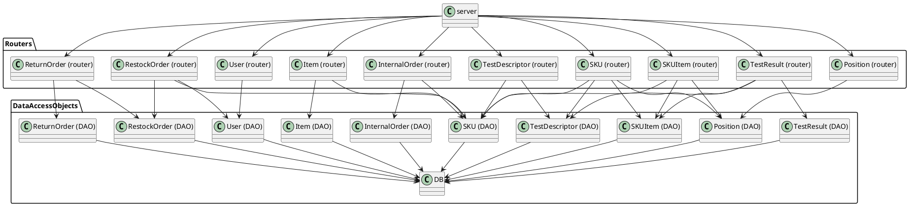

# Integration and API Test Report

Date:

Version:

# Contents

- [Dependency graph](#dependency graph)

- [Integration approach](#integration)

- [Tests](#tests)

- [Scenarios](#scenarios)

- [Coverage of scenarios and FR](#scenario-coverage)
- [Coverage of non-functional requirements](#nfr-coverage)

# Dependency graph 

     
# Integration approach

    <Write here the integration sequence you adopted, in general terms (top down, bottom up, mixed) and as sequence
    (ex: step1: class A, step 2: class A+B, step 3: class A+B+C, etc)> 
    <Some steps may  correspond to unit testing (ex step1 in ex above), presented in other document UnitTestReport.md>
    <One step will  correspond to API testing>
    

#  Integration Tests

   <define below a table for each integration step. For each integration step report the group of classes under test, and the names of
     Jest test cases applied to them, and the mock ups used, if any> Jest test cases should be here code/server/unit_test

## Step 1
| Classes  | mock up used |Jest test cases |
|--|--|--|
||||

## Step 2
| Classes  | mock up used |Jest test cases |
|--|--|--|
||||

## Step n 

   
| Classes  | mock up used |Jest test cases |
|--|--|--|
||||

# API testing - Scenarios

<If needed, define here additional scenarios for the application. Scenarios should be named
 referring the UC in the OfficialRequirements that they detail>

## Scenario UCx.y

| Scenario |  name |
| ------------- |:-------------:| 
|  Precondition     |  |
|  Post condition     |   |
| Step#        | Description  |
|  1     |  ... |  
|  2     |  ... |

# Coverage of Scenarios and FR

<Report in the following table the coverage of  scenarios (from official requirements and from above) vs FR. 
Report also for each of the scenarios the (one or more) API Mocha tests that cover it. >  Mocha test cases should be here code/server/test

| Scenario ID | Functional Requirements covered | Mocha  Test(s) | 
| ----------- | ------------------------------- | ----------- | 
|  ..         | FRx                             |             |             
|  ..         | FRy                             |             |             
| ...         |                                 |             |             
| ...         |                                 |             |             
| ...         |                                 |             |             
| ...         |                                 |             |             

# Coverage of Non Functional Requirements

### 

| Non Functional Requirement | Test name |
| -------------------------- | --------- |
|   NFR9    |     testSkuItem.js &emsp; --> &emsp; "PUT /api/skuitems/:rfid (errors)"      |
| NFR6 |  testSkuItem.js &emsp; --> &emsp; "GET /api/skus/:id (errors)"|
| NFR4 | testPosition.js &emsp; --> &emsp; "POST /api/positions (errors)" |
| NFR2 |  |
