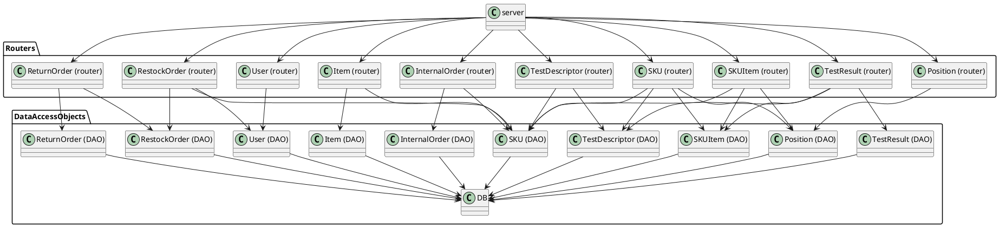

# Integration and API Test Report

Date:

Version:

# Contents

- [Dependency graph](#dependency graph)

- [Integration approach](#integration)

- [Tests](#tests)

- [Scenarios](#scenarios)

- [Coverage of scenarios and FR](#scenario-coverage)
- [Coverage of non-functional requirements](#nfr-coverage)

# Dependency graph 

     
# Integration approach

   In the api testing , we are directly integrating the unit tests, in order to satisfy the APIs. Therefore, no intergration steps were done, but directly API testing.
    

# API testing - Scenarios

<If needed, define here additional scenarios for the application. Scenarios should be named
 referring the UC in the OfficialRequirements that they detail>

## Scenario 1-4

| Scenario |  List SKUs |
| ------------- |:-------------:| 
|  Precondition     | Manager M exists and is logged in |
|  Post condition   | Show all SKUs  |
| Step#  | Description               |
|  1     | M goes to SKU page        |
|  2     | System provide exist SKUs |

## Scenario 1-5

| Scenario |  Search specific SKU |
| ------------- |:-------------:| 
|  Precondition     | Manager M exists and is logged in |
|  Post condition   | Showing SKU info |
| Step#  | Description |
|  1     | M check all SKUs        |
|  2     | M select one SKU        |
|  3     | System provide SKU info |

## Scenario 1-6

| Scenario |  Delete SKU |
| ------------- |:-------------:| 
|  Precondition     | Manager M exists and is logged in |
|                   | SKU s exists      |
|  Post condition   | SKU s deleted |
| Step#  | Description |
|  1     | M select a SKU s       |
|  2     | M delete s              |
|  3     | System delete s in DB   |

## Scenario 2-6

| Scenario |  List positions |
| ------------- |:-------------:| 
|  Precondition     | Manager M exists and is logged in |
|  Post condition   | Showing all positions |
| Step#  | Description |
|  1     | M goes to position page        |
|  2     | System provide exist positions |

## Scenario 10-2

| Scenario |  List internal orders |
| ------------- |:-------------:| 
|  Precondition     | Manager M exists and is logged in |
|  Post condition   | Showing all internal order info |
| Step#  | Description |
|  1     | M goes to internal orders page        |
|  2     | System provide exist internal orders |

## Scenario 10-3

| Scenario |  Delete internal orders |
| ------------- |:-------------:| 
|  Precondition     | Manager M exists and is logged in |
|  Post condition   | internal order io deleted |
| Step#  | Description |
|  1     | M select a internal order io       |
|  2     | M delete io              |
|  3     | System delete io in DB   |

# Coverage of Scenarios and FR

<Report in the following table the coverage of  scenarios (from official requirements and from above) vs FR. 
Report also for each of the scenarios the (one or more) API Mocha tests that cover it. >  Mocha test cases should be here code/server/test

| Scenario ID | Functional Requirements covered | Mocha  Test(s) | 
| ----------- | ------------------------------- | ----------- | 
|  S1-1         |   FR2 |Create new sku | 
|S1-1|FR2 | Create a invalid sku          |             
| S1-2   | FR2 | Update sku position with invalid ID |
| S1-2   | FR2 | Update sku position with invalid position|
| S1-2   | FR2 | Update sku position with empty body|
| S1-2   | FR2 | Update sku position with invalid sku  |
| S1-4   | FR2 | Get all skus    |
| S1-5   | FR2 | Get a existing sku by id    |
| S1-5   | FR2 | ID not found    |
| S1-5   | FR2 | Get sku with invalid id    |
| S1-6   | FR2 | Delete sku by id  |
| S1-6   | FR2 | Delete sku with invalid ID    |
| S2-1   | FR3 | Create a new position |
| S2-1   | FR3 | Create a position with invalid body    |
| S2-2   | FR3 | Update positionID   |
| S2-2   | FR3 | Update positionID with  not exist positionID  |
| S2-2   | FR3 | Update positionID with invalid body  |
| S2-3, S2-4   | FR3 | Update position  |
| S2-3, S2-4   | FR3 | Update position with  not exist positionID |
| S2-5   | FR3 | Delete position by id |
| S2-5   | FR3 | Delete position with  not exist positionID    |
| S2-6   | FR3 | Get all positions    |
| S3-1, S3-2   | FR5 | Create new restock order    |
| S3-1, S3-2   | FR5 | Create restock order with invalid body    |
| S4-1   | FR1 | Create new user    |
| S4-1   | FR1 | Create new user  with wrong invalid body  |
| S4-3   | FR1 | Delete user by username and type  |
| S4-3   | FR1 | Delete user by invalid username and invalid type  |
| S5-1-1, S5-2-1 | FR5 | Update RestockOrder    |
| S6-1, S6-2   | FR5 | Create new return order |
| S6-1, S6-2  | FR5 | Create invalid return order    |
| S6-1, S6-2   | FR5 | Create return order with not exist restock order     |
| S9-1   | FR6 | Update state of  InternalOrder to ACCEPTED   |
| S9-2   | FR6 | Update InternalOrder state to REFUSED   |
| S9-3   | FR6 | Update InternalOrder state to CANCELLED   |
| S10-1  | FR6 | Update InternalOrder state to COMPLETED   |
| S10-2  | FR6 | Get all InternalOrder    |
| S10-3  | FR6 | Delete InternalOrder    |
| S11-1  | FR7 | Create new skuitem    |
| S11-1  | FR7 | Create new skuitem with invalid parameters  |
| S11-1  | FR7 | Add one skuitem but SKUId not found    |
| S11-2  | FR7 | Update one skuitem   |
| S11-2  | FR7 | Update one skuitem with invalid parameters    |
| S11-2  | FR7 | Update one skuitem with not exist SKU item  |
| S11-3  | FR7 | Delete sku item by RFID   |
| S11-3  | FR7 | Delete sku item with invalid RFID   |

| S12-1  | FR3 | Create new test description   |
| S12-1  | FR3 | Create new test description with invalid skuId   |
| S12-2  | FR3 | Update test description    |
| S12-2  | FR3 | Update a not exists test description    |
| S12-2  | FR3 | Update with invalid parameters    |
| 12-3   | FR3 | Delete test description by id |       

# Coverage of Non Functional Requirements

### 

| Non Functional Requirement | Test name |
| -------------------------- | --------- |
|   NFR9    |     testSkuItem.js &emsp; --> &emsp; "PUT /api/skuitems/:rfid (errors)"      |
| NFR6 |  testSkuItem.js &emsp; --> &emsp; "GET /api/skus/:id (errors)"|
| NFR4 | testPosition.js &emsp; --> &emsp; "POST /api/positions (errors)" |
| NFR2 |  |
