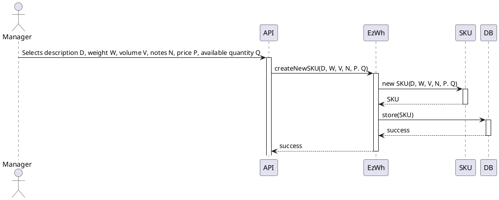
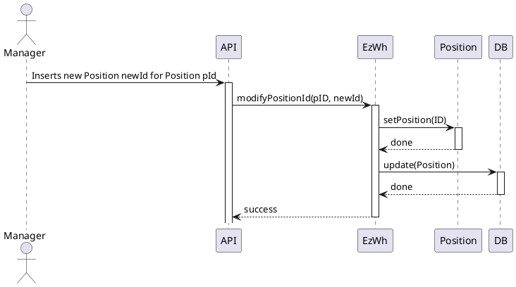
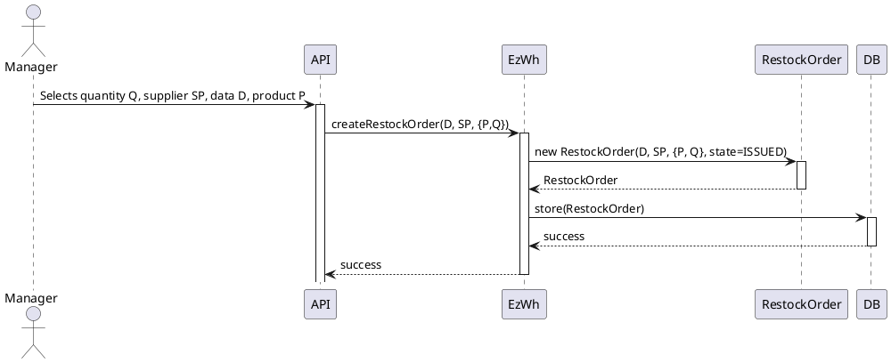
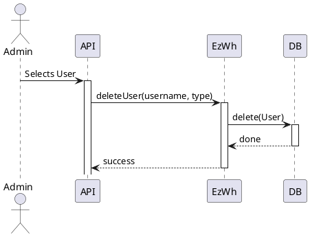
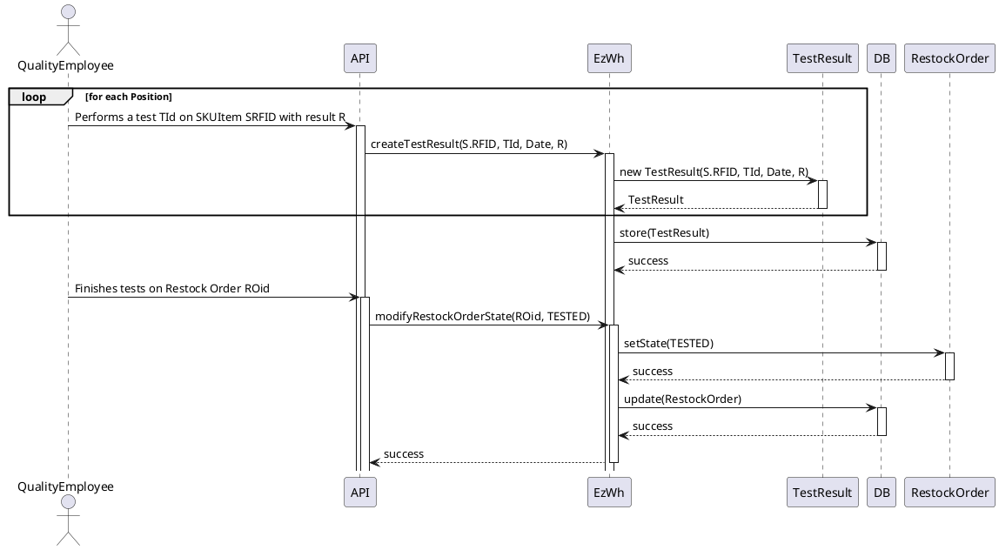
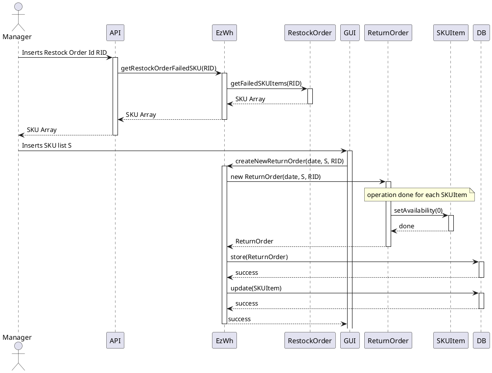
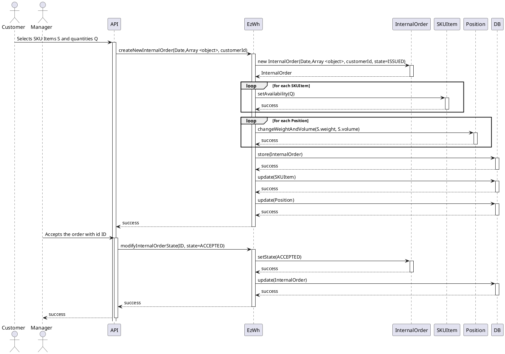

# Design Document 

Authors: 

Date:

Version:

# Contents

- [Design Document](#design-document)
- [Contents](#contents)
- [Instructions](#instructions)
- [High level design](#high-level-design)
- [Low level design](#low-level-design)
- [Verification traceability matrix](#verification-traceability-matrix)
- [Verification sequence diagrams](#verification-sequence-diagrams)
  - [Scenario 1.1](#scenario-11)
  - [Scenario 2.2](#scenario-22)
  - [Scenario 3.1](#scenario-31)
  - [Scenarios 4.3](#scenarios-43)
  - [Scenario 5.2.1](#scenario-521)
  - [Scenario 6.1](#scenario-61)
  - [Scenario 9.1](#scenario-91)

# Instructions

The design must satisfy the Official Requirements document, notably functional and non functional requirements, and be consistent with the APIs

# High level design 

<discuss architectural styles used, if any>
<report package diagram, if needed>

# Low level design

<for each package in high level design, report class diagram. Each class should detail attributes and operations>

# Verification traceability matrix

\<for each functional requirement from the requirement document, list which classes concur to implement it>

|      | EzWh  | User | SKU  | SKUItem | TestResult | TestDescriptor | Position | RestockOrder | Item |
|----- | :---: | :--: | :--: | :-----: | :--------: | :------------: | :------: | :----------: | :--: |
FR1    |       |      |      |         |            |                |          |              |      |
FR1.1  |       |      |      |         |            |                |          |              |      |
FR2    |       |      |      |         |            |                |          |              |      |
FR3    |       |      |      |         |            |                |          |              |      |
FR4    |       |      |      |         |            |                |          |              |      |
FR5    |       |      |      |         |            |                |          |              |      |
FR6    |       |      |      |         |            |                |          |              |      |
FR7    |       |      |      |         |            |                |          |              |      |

# Verification sequence diagrams 
\<select key scenarios from the requirement document. For each of them define a sequence diagram showing that the scenario can be implemented by the classes and methods in the design>

## Scenario 1.1

## Scenario 2.2

## Scenario 3.1 

## Scenarios 4.3

## Scenario 5.2.1 

## Scenario 6.1

## Scenario 9.1

