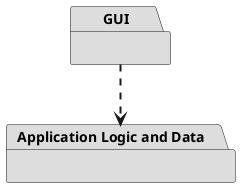
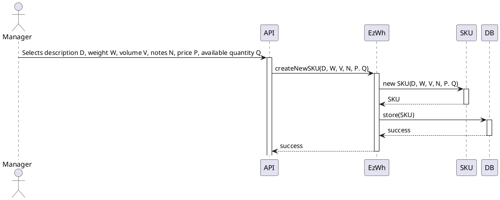
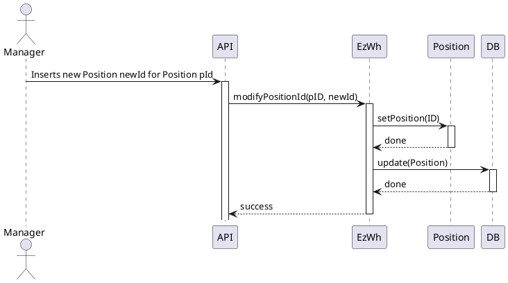
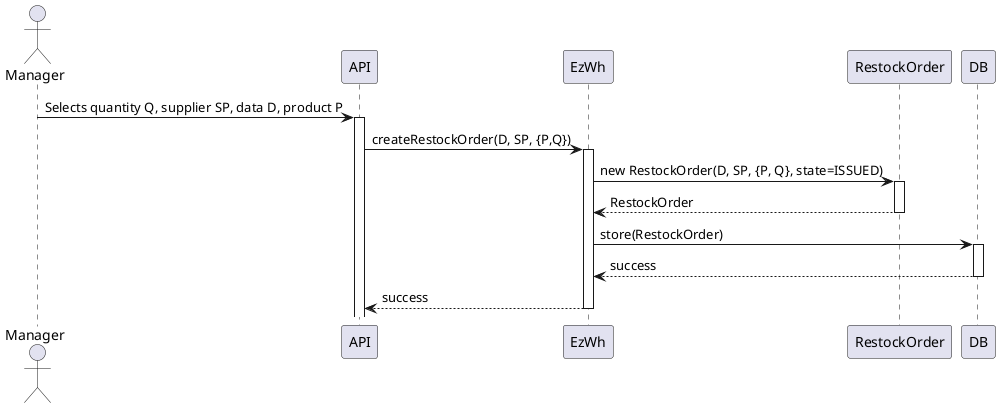
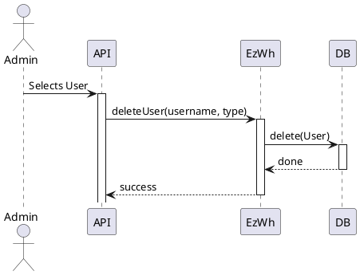
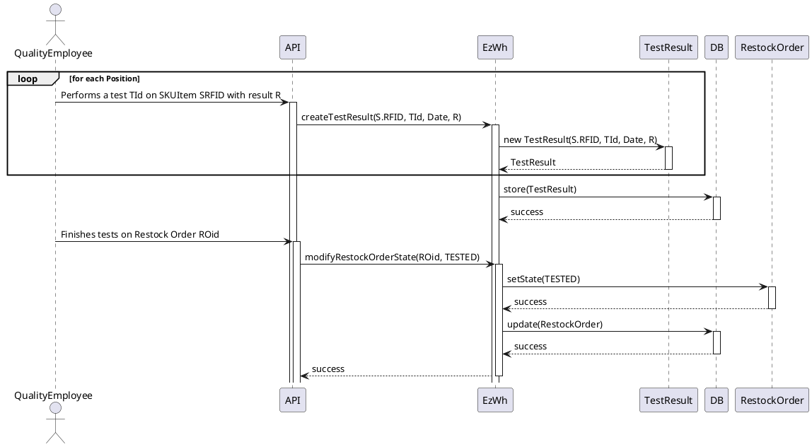
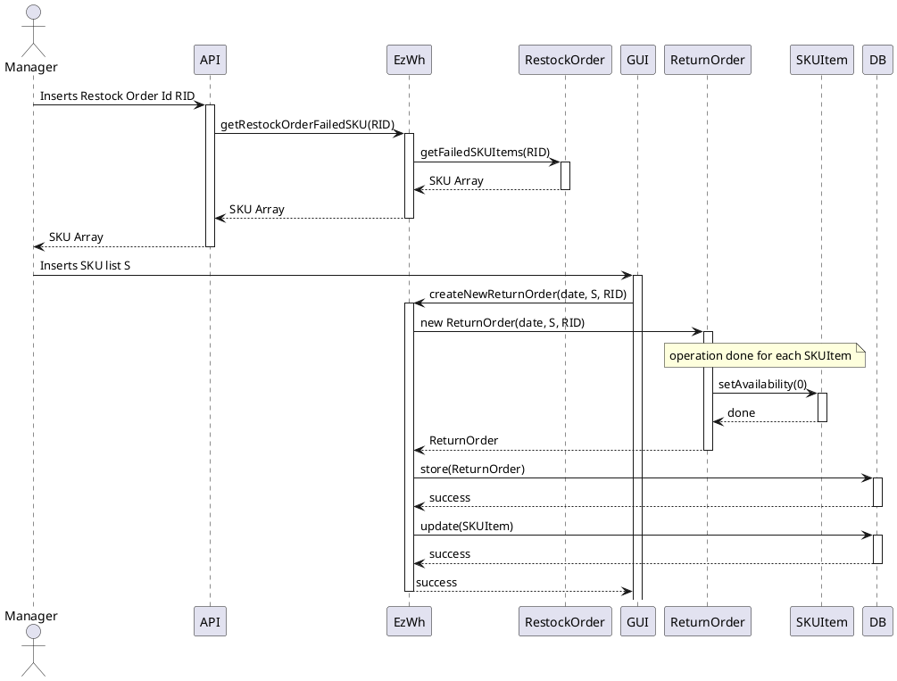
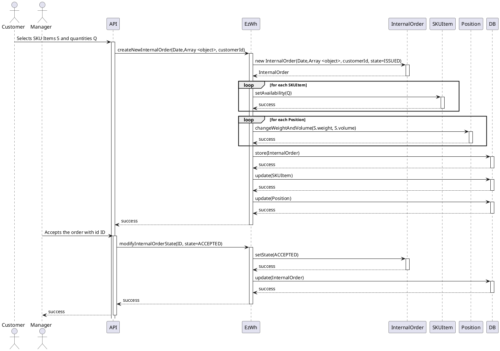

# Design Document 


Authors: Group37

Date: 27/04/2022

Version:


# Contents

- [Design Document](#design-document)
- [Contents](#contents)
- [Instructions](#instructions)
- [High level design](#high-level-design)
- [Low level design](#low-level-design)
- [Verification traceability matrix](#verification-traceability-matrix)
- [Verification sequence diagrams](#verification-sequence-diagrams)
  - [Scenario 1.1: Create SKU S](#scenario-11-create-sku-s)
  - [Scenario 2.2: Modify positionID of P](#scenario-22-modify-positionid-of-p)
  - [Scenario 3.1: Restock Order of SKU S issued by quantity](#scenario-31-restock-order-of-sku-s-issued-by-quantity)
  - [Scenarios 4.3: Delete user](#scenarios-43-delete-user)
  - [Scenario 5.2.1: Record positive test results of all SKU items of a RestockOrder](#scenario-521-record-positive-test-results-of-all-sku-items-of-a-restockorder)
  - [Scenario 6.1: Return order of SKU items that failed quality test](#scenario-61-return-order-of-sku-items-that-failed-quality-test)
  - [Scenario 9.1: Internal Order IO accepted](#scenario-91-internal-order-io-accepted)

# Instructions

The design must satisfy the Official Requirements document, notably functional and non functional requirements, and be consistent with the APIs

# High level design 


This EzWh design model implements a layered architectural pattern. The base idea is the 3-tier architecture (presentation, application logic layer, data (DBMS) layer): the two lower tiers (application logic and data) are merged together, so the final architectural patter is a 2-tier. There are therefore two packages. The GUI is already defined and interfaces with the other package using HTTP calls, defined in the API. The backend side of the EzWh application is managed in the "Application Logic and Data".

# Low level design


```plantuml
@startuml
class EzWh{
    
}

note right of EzWh
This class implements the relations with the other classes using lists.
EzWh acts as a container of other class instances.
end note

note right of EzWh
We assume that all the constructors are implemented
end note

Class Position {
  -PositionID: String
  -Aisle: String
  -Row: String
  -Column: String
  -MaxWeight: Integer
  -MaxVolume: Integer
  -OccupiedWeight: Integer
  -OccupiedVolume: Integer
  --
  +getAllPositions(): Array<Object>
  +getPositionById(id: Integer):Object
  +createNewPosition(aisleID:String, row:String, icol:String, maxWeight:Integer, maxVolume:Integer): void
  +modifyPosition(positionID:String, newAisleID:String, newRow:String, newCol:String, newMaxWeight:Integer, newMaxVolume:Integer, newOccupiedWeight:Integer, newOccupiedVolume:Integer): void
  +modifyPositionId(oldPositionID:String, newPositionID:String): void
  +deleteSKUItemByPositionID(positionID): void
  searchPosition(positionID:Integer):Object
}

Class SKU {
  -ID: Integer
  -Description: String
  -Weight: Integer
  -Volume: Integer
  -Price: Float
  -Note: String
  -positionID: String
  -availableQuantity: Integer
  -testDescriptors: Array<TestDescriptor>
  --
  ~getLasSKUId():Integer
  +getSKUIdByPosition(positionID: Integer):Integer
  +getAllSKU(): Array<Object>
  +getSKUByDescription(in str:description): Object
  +getSKUById(id :Integer): Object
  +createNewSKU(description:String, weight:Integer, volume:Integer, notes:String, price:Float, availableQuantity:Integer): void
  +modifySKU(id:Integer, newDescription:String, newWeight:Integer, newVolume:Integer, newNotes:String, newPrice:Float, newAvailableQuantity:Integer): void
  +addOrModifyPositionSKU(id:Integer): void
  +deleteSKU(id:Integer): void
  +decreaseSKUavailableQuantity(id: Integer): void
  +increaseSKUavailableQuantity(id: Integer): void
}

Class TestDescriptor {
  -ID: Integer
  -Name: String
  -Description: String
  -idSku: Integer
  --
  ~getLastTestDescriptorsId():Int
  +getAllTestDescriptors(): Array<Object>
  +getTestDescriptorById(id:Integer): Object
  +getTestDescriptorByIdSKUId(skuId:Integer): Int
  +createNewTestDescriptor(name:String, procedureDescription:String, idSKU:Integer): void
  +modifyTestDescriptor(newName:String, newProcedureDescription:String, newIdSKU:Integer): void
  +deleteTestDescriptor(id:Integer): void

}

Class TestResult {
  -ID: Integer
  -Date: String
  -Result: boolean
  -idTestDescriptor: Integer
  -SKUId: Integer
  --
  +getAllTestResultsByRFID(RFID:String): Array<Object>
  +getTestResultById(idTestDescriptor:Integer, RFID:String): Object
  ~searchMaxID=():Int
  +createTestResult(RFID:String, idTestDescriptor:Integer, Date:String, Result:Integer): void
  +modifyTestResult(RFID:String, idTestResult:Integer, newIdTestDescriptor:Integer, newDate:String, newResult:Boolean): void
  +deleteTestResult(RFID:String, idTestResult:Integer): void
  --
}

Class Item {
  -ID: Integer
  -Description: String
  -Price: float
  -SKUId: Integer
  -supplierId: Integer
  --
  +getAllItems(): Array<Object>
  +getItemById(id:Integer): Object
  +createNewItem(description:String, price:Float, SKUId:Integer, supplierId:Integer): void
  +modifyItem(id:Integer, newDescription:String, newPrice:Float): void
  +deleteItem(id:Integer): void
  
}

Class InternalOrder {
  -id: Integer
  -issueDate: String
  -State: state
  -customerId: Integer
  -products: Array<Object>
  --
  +getAllInternalOrders(): Array<Object>
  +getInternalOrdersIssued(): Array<Object>
  +getInternalOrdersAccepted(): Array<Object>
  +getInternalOderByState(state: String): Object
  +getInternalOrderById(id:Integer): Object
  +createNewInternalOrder(issueDate:String, products:Array<Object>, customerId:Integer): void
  +getLastInternalOrderId():Integer
  +modifyInternalOrderState(id:Integer, newState:String, [optional] products:Array<Item>): void
  +deleteInternalOrderById(id:Integer): void
  --
  +getAllInternalOrdersProduct():Array<Object>
  +getInternalOrdersProductsById(id:Integer):Array<Object>
  +getInternalOrdersProductBySkuId(skuId: Integer): Object
  --
  +getAllInternalOrdersSKUItems():Array<Object>
  +getInternalOrderSKUItemById(internalOrderId:Integer):Array<Object>
  +addInternalOrdersSKUItems(internalOrderID:Integer, RFID:Interger):void
  +modifyInternalOrderSKUItems(id:Integer, RFID:Integer):void
  +addInternalOrdersProducts(internalOrderID:Integer,skuID: Integer, quantity:Integer):void
  +deleteInternalOrderProducts(internalOrderID:Integer):void
  +deleteInternalOrderSKUItems(internalOrderID:Integer):void
}

note right of InternalOrder::products
  "products" contains objects
 describing <b>SKU items</b>
 and their <b>quantity</b>:
 {SKUItem, quantity}.
end note

Class SKUItem {
  -RFID: String
  -Available: Integer
  -DateOfStock: String
  -SKUId: Integer
  --
  +getAllSKUItems(): Array<Object>
  +getSKUItemsByID(SKUId:Integer): Array<Object>
  +getSKUItemByRFID(RFID: String): Object
  +createNewSKUItem(RFID:String, SKUId:Integer, DateOfStock:String): void
  +modifySKUItem(SKUId:Integer, newRFID:String, newAvailable:Integer, newDateOfStock:String): void
  +deleteSKUItem(RFID:String): void
  +updatePositionWeightAndVolume(positionID: Integer,newOccupiedWeight: Double, newOccupiedVolume: Double): void
  
}

Class User {
  -ID: Integer
  -Surname: String
  -Name: String
  -Email: String
  -Type: String
  -HashPassword: String
  --
  +getUserInfo(): Object
  +getUserInfoById(id:Int): Object
  +getAllUsersExceptManagers(): Array<Object>
  +getAllSuppliers(): Array<Object>
  +getAllUsers(): Array<Object>
  +createNewUser(username:String, name:String, surname:String, password:String, type:String): void
  ~searchMaxID():Int
  +getUserByUsernameAndType(username:String,type:string): Object
  +managerSessions(username:String, password:String): void
  +customerSessions(username:String, password:String): void
  +supplierSessions(username:String, password:String): void
  +clerkSessions(username:String, password:String): void
  +qualityEmployeeSessions(username:String, password:String): void
  +deliveryEmployeeSessions(username:String, password:String): void
  +logout(): void
  +modifyUserRight(username:String, newType:String): void
  +deleteUser(username:String, type:String): void
  --
}

note left of RestockOrder::products
  "products" contains objects
 describing <b>SKUItems</b>
 and their <b>quantity</b>:
 {SKUItem, quantity}.
end note

Class RestockOrder {
  -id: Integer
  -IssueDate: String
  -State: state
  -products: Array<Object>
  -supplierId: Integer
  -TransportNote: TransportNote
  --
  +getRestockOrders(): Array<Object>
  +getRestockOrdersProducts(restock_id:Integer): Array<Object>
  +getRestockOrdersSKUItems(restock_id:Integer): Array<Object>
  +getRestockOrdersIssued(): Array<Object>
  +getRestockOrderById(id:Integer): Object
  +getRestockOrderFailedSKUItems(id:Integer): Array<Object>
  ~getLastPIDInOrder():Integer
  +insertProductInOrder(id:Integer,restockOrderId:Integer,skuId:Integer,qty:Integer):void
  +createRestockOrder(issueDate:String, products:Array<Item>, supplierId:Integer): void
  ~getLastIdRso():Integer
  +removeSKUItemFromRestockOrder(skuId: Integer, id:Integer): void
  +modifyRestockOrderState(id:Integer, newState:String): void
  +addRestockOrderSKUItems(id:Integer, skuItems:Array<SKUItem>): void
  +addRestockOrderTransportNote(id:Integer, transportNote:Object): void
  +getRestockOrderTransportNote(id:Integer):Object
  +deleteRestockOrder(id:Integer): void
  +deleteSkuItemsFromRestockOrder(id:Integer):void
  +deleteRstockOrderTransportNote(id:Integer):void
  +deleteProductsFromRestockOrder(id:Integer):void
  +getSupplierById(id:Integer):Object
  +getSKUByIdFromRestockOrder(skuId:Integer,restockOrderID:Integer):Object

}

enum restock_state{
  ISSUED
  DELIVERY
  DELIVERED
  TESTED
  COMPLETEDRETURN
  COMPLETED
}

enum internal_state{
  ISSUED
  ACCEPTED
  REFUSED
  CANCELLED
  COMPLETED
}

Class ReturnOrder {
  -ID: Integer
  -ReturnDate: String
  -restockOrder: RestockOrder
  --
  +getReturnOrders(): Array<Object>
  +getReturnOrderById(id:Integer): Object
  +getReturnOrderProducts(id:Integer):Object
  ~getLastReturnOrderId():Integer
  +insertProductInRO(product:Object,id:Integer):void
  +createNewReturnOrder(returnDate:String, id:Integer, restockOrderId:Integer): void
  +deleteReturnOrder(id:Integer): void
  +de;eteReturnOrderProducts(id:Integer): void
  +getRFIDFromRestockOrder(RFID:Integer, restockOrderId): Object

}

Class DBHelper {
  -dbName: String
  --
  -connect(): void
  -createTables(): void
  --
  ~loadSKUs(): list<SKU>
  ~loadSKUItems(): list<SKUItem>
  ~loadPositions(): list<Position>
  ~loadTestDescriptors(): list<TestDescriptor>
  ~loadTestResults(): list<TestResult>
  ~loadUsers(): list<User>
  ~loadRestockOrders(): list<RestockOrders>
  ~loadReturnOrders(): list<ReturnOrders>
  ~loadInternalOrders(): list<InternalOrders>
  ~loadItems(): list<Items>
  --
  ~store(sql: String): void
  ~update(sql: String): void
  ~delete(sql: String): void
}

EzWh --> Position
EzWh --> SKU
EzWh --> SKUItem
EzWh --> TestDescriptor
EzWh --> TestResult
EzWh --> Item
EzWh --> InternalOrder
EzWh --> User
EzWh --> RestockOrder
EzWh --> ReturnOrder
EzWh --> DBHelper

SKU <--> "*" TestDescriptor
SKUItem "*" --> SKU

TestResult --> TestDescriptor
TestResult --> SKUItem
Position <-- SKU
Item "*" --> SKU
Item --> User
InternalOrder --> "*" SKUItem
InternalOrder --> User
InternalOrder ..> internal_state
RestockOrder --> "*" SKUItem
RestockOrder --> User
RestockOrder ..> restock_state
ReturnOrder "0..1"--> RestockOrder
@enduml

```

The pattern used for the Lower Level Design is the *façade pattern*. In this way, the user can only interact with the backend throught *EzWh* class. EzWh manages the user interactions with the backend, hidding the other classes and their attributes.


# Verification traceability matrix


|    	| EzWh  | User 	| SKU  	| SKUItem | TestResult | TestDescriptor | Position | RestockOrder | Item | ReturnOrder 	| InternalOrder |
|----- 	| :---: | :--: 	| :--: 	| :-----: | :--------: | :------------: | :------: | :----------: | :--: |:-----------:	|:-------------:|
FR1		|   x    |   x   |      	|         |            |                |          |              |      |				|				|
FR1.1  	|   x    |   x   |      	|         |            |                |          |              |      |||
FR1.2  	|   x    |       |      	|         |            |                |          |              |      |||
FR1.3 	|   x    |   x   |      	|         |            |                |          |              |      |||
FR1.4 	|   x    |   x   |      	|         |            |                |          |              |      |||
FR1.5  	|   x    |   x   |      	|         |            |                |          |              |      |||
FR2    	|   x    |      	|   x   |         |            |                |          |              |      |||
FR2.1  	|   x    |      	|   x   |         |            |                |          |              |      |||
FR2.2  	|   x    |      	|      |         |            |                |          |              |      |||
FR2.3  	|   x    |      	|   x   |         |            |                |          |              |      |||
FR2.4  	|   x   |      	|   x   |         |            |                |          |              |      |||
FR3    	|   x  |      	|      	|         |      x     |         x      |     x    |              |      |||
FR3.1   |   x |      	|      |         |            |                |     x     |              |      |||
FR3.1.1 |   x |      	|      |         |            |                |    x      |              |      |||
FR3.1.2 |   x    |      	|      |         |            |                |    x      |              |      |||
FR3.1.3 |   x    |      	|      |         |            |                |    x      |              |      |||
FR3.1.4 |   x    |      	|      |         |            |                |    x      |              |      |||
FR3.2   |   x    |      	|      |         |            |       x         |          |              |      |||
FR3.2.1 |   x    |      	|      |         |            |      x          |          |              |      |||
FR3.2.2 |    x   |      	|      |         |            |      x          |          |              |      |||
FR3.2.3 |    x   |      	|      |         |            |                |          |              |      |||
FR4    	|    x   |  x    |      |         |            |                |          |              |      |||
FR4.1   |    x   |  x    |      |         |            |                |          |              |      |||
FR4.2   |    x   |      |      |         |            |                |          |              |      |||
FR4.3   |    x   |  x    |      |         |            |                |          |              |      |||
FR4.4   |    x   |  x    |      |         |            |                |          |              |      |||
FR5    	|    x   |      |   x   |     x    |     x       |                |   x       |      x        |    | x ||
FR5.1   |    x  |      |      |         |            |                |          |    x          |      |||
FR5.2   |   x    |      | x     |         |            |                |          |  x            |      |||
FR5.3   |    x   |      |      |         |            |                |          |     x         |      |||
FR5.4   |    x   |      |      |         |            |                |          |      x        |      |||
FR5.5   |    x   |      |      |         |            |                |          |      x        |      |||
FR5.6   |    x   |      |      |         |            |                |          |      x        |      |||
FR5.7   |    x   |      |      |         |            |                |          |      x        |      |||
FR5.8   |    x   |      |   x   |   x      |     x       |                |          |      x        |     || |
FR5.8.1 |    x   |      |      |    x     |      x      |                |          |              |      |||
FR5.8.2 |    x   |      |      |    x     |            |                |          |              |      |||
FR5.8.3 |    x   |      |      |         |            |                |    x      |              |      |||
FR5.9   |    x   |      |      |    x     |            |                |          |      x        |      |x||
FR5.10  |    x   |      |      |    x     |            |                |          |      x        |      |x||
FR5.11  |    x   |      |      |         |            |                |          |              |      |x||
FR5.12  |    x   |      |      |         |            |                |          |              |      |x||
FR6    |     x  |      |     x |     x    |            |                |     x     |              |    x  ||x|
FR6.1    |   x    |      |   x  |         |            |                |          |              |      ||x|
FR6.2    |   x    |      |      |         |            |                |          |              |      ||x|
FR6.3    |   x    |      |      |         |            |                |          |              |      ||x|
FR6.4    |   x    |      |      |         |            |                |          |              |      ||x|
FR6.5    |   x    |      |      |         |            |                |          |              |      ||x|
FR6.6    |   x    |      |      |         |            |                |          |              |      ||x|
FR6.7    |   x    |      |      |         |            |                |          |              |      ||x|
FR6.8    |   x    |      |      |         |            |                |          |              |      ||x|
FR6.9    |   x    |      |      |    x     |            |                |          |              |      ||x|
FR6.10    |  x     |      |      |   x      |            |                |     x     |              |      |||
FR7    |     x  |      |      |         |            |                |          |              |     x |||


# Verification sequence diagrams 

In all the Sequence Diagrams is assumed that all the data are already loaded from the db.

## Scenario 1.1: Create SKU S


## Scenario 2.2: Modify positionID of P



## Scenario 3.1: Restock Order of SKU S issued by quantity

## Scenarios 4.3: Delete user


## Scenario 5.2.1: Record positive test results of all SKU items of a RestockOrder


## Scenario 6.1: Return order of SKU items that failed quality test


## Scenario 9.1: Internal Order IO accepted


