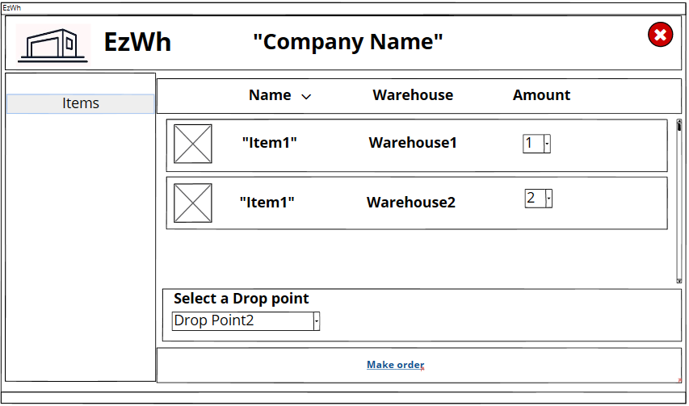
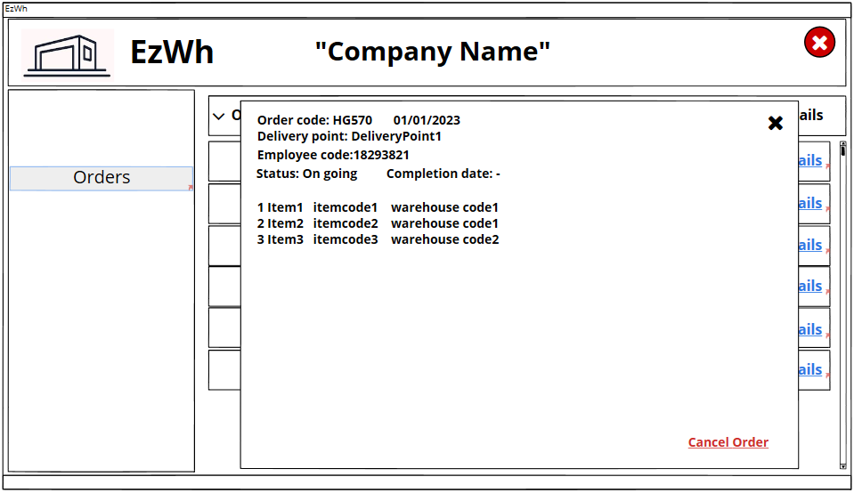

# Graphical User Interface Prototype  

<<<<<<< HEAD
Authors: Group 37
Date: 11/04/2022
=======
Authors:

Date:
>>>>>>> 564a73f1a48bf38d442c568d93a189cb071ff0fb

Version:

\<Report here the GUI that you propose. You are free to organize it as you prefer. A suggested presentation matches the Use cases and scenarios defined in the Requirement document. The GUI can be shown as a sequence of graphical files (jpg, png)  >

<<<<<<< HEAD
# UC1: Manage User Account
##  Scenarios
### **1.1: User registration**

### **1.2: User profile management**

### **1.3: Delete user**

### **1.4: Send user sign up request**

# UC2: Authorize and Authenticate
## Scenarios
### **2.1: Login**

### **2.2: Exception: wrong password**

### **2.4: Exception: account not defined**

# UC3: Item Management
##  Scenarios
### **3.2: Add new item in the warehouse using barcode scanner or manually**

- If the user presses the button "Add using scanner", all the fields will be automatically filled in, otherwise he can insert them manually.
- Scenario 3.1 refers to a similar wire frame but for the supplier.

### **3.3: Exception: item already exists**

When the user presses on "Confirm", if the item already exists, the error message appears and the item is not added.

### **3.4: Show item information**

### **3.7 - 3.8:** 
Refers to previous scenario.

# UC4: CRUD Internal order 
##  Scenarios
### **4.1: Add internal order**

### **4.2: Cancel internal order**

# UC5: CRUD Internal order 
##  Scenarios
### **5.4: Show internal order list**

# UC6: Manage Suppliers 
##  Scenarios
### **6.1: Add new supplier**

### **6.2: Modify supplier**

### **6.4: Show supplier information**

After selection, open image above (scenario 6.2)

# UC8: 
## Scenarios
### **8.1 Add new Test**

### **8.2 Modify test**

### **8.3 Delete Test**

# UC9: 
## Scenarios
### **9.1 Add WH**

### **9.2 Modify WH**

### **9.3 Delete WH**

### **9.4 Show WH details**
 See 9.2

# UC10: 
## Scenarios
### **10.1 Issue an order to Supplier**

### **10.4 List supplier's incoming orders**

# UC11: 
## Scenarios
### **11.1 Add Drop Point**

### **11.2-11.3 Delete and List Drop Points**

# UC12: 
## Scenarios
### **12.1 Add Item to test**

### **12.2 Remove/Cancel Item from test**

### **12.3 List Tested Items**

# UC13: 
## Scenarios
### **13.1 show WH on a map**
(see requirement 9.2)

=======
>>>>>>> 564a73f1a48bf38d442c568d93a189cb071ff0fb
