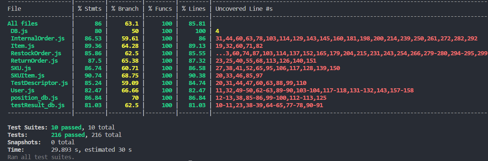

# Unit Testing Report

Date:

Version:

# Contents

- [Black Box Unit Tests](#black-box-unit-tests)

- [White Box Unit Tests](#white-box-unit-tests)

# Black Box Unit Tests

    <Define here criteria, predicates and the combination of predicates for each function of each class.
    Define test cases to cover all equivalence classes and boundary conditions.
    In the table, report the description of the black box test case and (traceability) the correspondence with the Jest test case writing the 
    class and method name that contains the test case>
    <Jest tests  must be in code/server/unit_test  >

 ### **User* - method *getUserInfo***

**Criteria for method *getUserInfo*:**
 - type of input: string, string  
 - correct username U
 - correct password P

**Predicates for method *getUserInfo*:**

| Criteria | Predicate |
| -------- | --------- |
|  U       |   U == true      |
|          |   U == false       |
|   P       |  P == true        |
|          |    P ==false       |

**Boundaries**:

| Criteria | Boundary values |
| -------- | --------------- |
|          |                 |
|          |                 |

**Combination of predicates**:

| U | P | Valid / Invalid | Description of the test case | Jest test case |
|-------|-------|-------|-------|-------|
|true   | true  |    V  |       |     | Get User Info (login):Login: correct username and password"   |
|       | false |    V  |       |       |   Get User Info (login):Login: incorrect username   |
|false  | true  |    V  |       |       |   Get User Info (login):Login: incorrect password)   |
|       | false  |    I  |       |      |    Get User Info (login):Login: incorrect username      |

 ### **Class *User* - method *createNewUser***

**Criteria for method *createNewUser*:**
 - type of input: object<user{id int, username string, name string,surname string,hashpassword string,type string}>
 - ID ID 
 - otherUserValues V

**Predicates for method *createNewUser*:**

| Criteria | Predicate |
| -------- | --------- |
|     ID     |    unique (u)    |
|          |     not unique (nu)      |
|    V      |      filled     |
|          |     missing      |

**Boundaries**:

| Criteria | Boundary values |
| -------- | --------------- |
|          |                 |
|          |                 |

**Combination of predicates**:

| ID    | V     |  Valid / Invalid | Description of the test case | Jest test case |
|-------|-------|-------|-------|-------|
|   unique    |   filled    |        V          |getMaxUserId()=6; createNewUser({ID,V});|   Create new User:Create new User, then get by Id|
|       |  missing          |        I              |                                  |   Create new User:Create new User: missing values|
|   not unique    |   filled    |        I          |                                   |   Create new User: Create new User: duplicated id|
|            |  missing    |        I         |                                   |   Create new User: Create new User: duplicated id |
|   wrong format    |   filled    |        I        |                                   |   Create new User:Create new User: missing values|
|       |  missing          |        I         |                                        |   Create new User:Create new User: missing values|

### **Class *User* - method *getUserInfoById***

**Criteria for method *getUserInfoById*:**
 - type of input: int
 -  ID is int ID1
- ID exists in DB ID2
**Predicates for method *getUserInfoById*:**

| Criteria | Predicate |
| -------- | --------- |
|     ID1     |      is int    |
|          |     not int      |
|     ID2     |      exist     |
|          |     doesn't exist      |

**Boundaries**:

| Criteria | Boundary values |
| -------- | --------------- |
|          |                 |
|          |                 |

**Combination of predicates**:

| ID1    | ID2    |  Valid / Invalid | Description of the test case | Jest test case |
|-------|-------|-------|-------|-------|
|   is int    |   exists    |        V          |getUserInfoById()|   Get User By:Get User By: Id|
|       |  doesnt exist          |        V              |getUserInfoById()     |   Get User ByGet User: user not found|
|   not int    |   exists   |        I          |                                   |  Get User ByGet User: user not found|
|            |  doesnt exist    |        I         |                                   |   Get User ByGet User: user not found|

### **Class *User* - method *getUserByUsernameAndType***

**Criteria for method *getUserByUsernameAndType*:**
 - type of input: string,string
 -  username exists in DB U
 - Type corresponds to username T

**Predicates for method *getUserByUsernameAndType*:**

| Criteria | Predicate |
| -------- | --------- |
|     U    |      exist     |
|          |     doesn't exist      |
|    T    |     true     |
|          |     false      |

**Boundaries**:

| Criteria | Boundary values |
| -------- | --------------- |
|          |                 |
|          |                 |

**Combination of predicates**:

| U    | T    |  Valid / Invalid | Description of the test case | Jest test case |
|-------|-------|-------|-------|-------|
|   exists    |   true   |        V          |getUserByUsernameAndType('user','type')| Get User By: Username and type   |
|       |  false          |        V         |getUserByUsernameAndType('user','type')           | Get User By: Username and type not found |
|   doesn't exist    |   true   |        I          |                                   |Get User By: Username and type not found |
|            |  false    |        I         |                                   | Get User By: Username and type not found |

### **Class *User* - method *getUserBysupplierId***

**Criteria for method *getUserBysupplierId*:**
 - type of input: int
 - supplierID exists in DB S
 - 

**Predicates for method *getUserBysupplierId*:**

| Criteria | Predicate |
| -------- | --------- |
|    S   |      exist     |
|          |     doesn't exist      |

**Boundaries**:

| Criteria | Boundary values |
| -------- | --------------- |
|          |                 |
|          |                 |

**Combination of predicates**:

| s      |  Valid / Invalid | Description of the test case | Jest test case |
|-------|-------|-------|-------|
| exists        |   V    |    getSupplierById(id)  |  Get User By: supplier id    |
| doesn't exists|   V    |   getSupplierById(id)   |  Get User By: supplier id not found |

### **Class *User* - method *searchMaxID***

**Criteria for method *searchMaxID*:**
 - 
 - 

**Predicates for method *searchMaxID*:**

| Criteria | Predicate |
| -------- | --------- |
|       |           |
|          |           |

**Boundaries**:

| Criteria | Boundary values |
| -------- | --------------- |
|          |                 |
|          |                 |

**Combination of predicates**:

|    |  Valid / Invalid | Description of the test case | Jest test case |
|-------|-------|-------|-------|
| | V|createNewUser({id=7}); searchMaxID();| Search Max Id: Get max Id of the table|

### **Class *User* - method *deleteUser***

**Criteria for method *deleteUser*:**
 -  there exists an user in DB - U
 - 

**Predicates for method *deleteUser*:**

| Criteria | Predicate |
| -------- | --------- |
|    U   |      t     |
|          |     f      |

**Boundaries**:

| Criteria | Boundary values |
| -------- | --------------- |
|          |                 |
|          |                 |

**Combination of predicates**:

|    U  |  Valid / Invalid | Description of the test case | Jest test case |
|-------|-------|-------|-------|
|t | V|createNewUser({id=6}); deleteUser(Id:6)| Delete User: Delete user by username and type |
|f | V| deleteUser(Id:6)| Delete User: Delete user by username and type|

### **Class *User* - method *modifyUserRights***

**Criteria for method *modifyUserRights*:**
 - 
 - 

**Predicates for method *modifyUserRights*:**

| Criteria | Predicate |
| -------- | --------- |
|          |           |
|          |           |

**Boundaries**:

| Criteria | Boundary values |
| -------- | --------------- |
|          |                 |
|          |                 |

**Combination of predicates**:

|      |  Valid / Invalid | Description of the test case | Jest test case |
|-------|-------|-------|-------|
| | V|createNewUser({id=6,username:"PaulRed@email.it", type:"supplier"}); modifyUserRights("PaulRed@email.it","supplier","newRights");| Modify user: ModifyUser rights |

### **Class *User* - method *getAllsuppliers***

**Criteria for method *getAllsuppliers*:**
 - 
 - 

**Predicates for method *getAllsuppliers*:**

| Criteria | Predicate |
| -------- | --------- |
|          |           |
|          |           |

**Boundaries**:

| Criteria | Boundary values |
| -------- | --------------- |
|          |                 |
|          |                 |

**Combination of predicates**:

|      |  Valid / Invalid | Description of the test case | Jest test case |
|-------|-------|-------|-------|
| | V|  createNewUser(id:7,type: supplier); getAllSuppliers();|Get all users:Get All suppliers|

### **Class *User* - method *getAllUsersExceptManagers***

**Criteria for method *getAllUsersExceptManagers*:**
 - 
 - 

**Predicates for method *getAllUsersExceptManagers*:**

| Criteria | Predicate |
| -------- | --------- |
|          |           |
|          |           |

**Boundaries**:

| Criteria | Boundary values |
| -------- | --------------- |
|          |                 |
|          |                 |

**Combination of predicates**:

|      |  Valid / Invalid | Description of the test case | Jest test case |
|-------|-------|-------|-------|
| | V|  createNewUser(id:7,type: supplier); getAllUsersExceptManagers();|Get all users:Get Users except managers|

### **Class *RestockOrder* - method *getRestockOrderById***

**Criteria for method *getRestockOrderById*:**
 -  Id exist in DB - ID

**Predicates for method *getRestockOrderById*:**

| Criteria | Predicate |
| -------- | --------- |
|    ID      |     t      |
|          |      f     |

**Boundaries**:

| Criteria | Boundary values |
| -------- | --------------- |
|          |                 |
|          |                 |

**Combination of predicates**:

|  ID    |  Valid / Invalid | Description of the test case | Jest test case |
|-------|-------|-------|-------|
|    t   |   V    |  createRestockOrder(date:d,supplierId:1id:1); getRestockOrderById(1); getRestockOrders()     | Create and get new RestockOrders: Create new RestockOreders    |
|    f   |   I    |   getRestockOrderById(4)   |   Create and get new RestockOrders:fail to get a non existing Order  |

### **Class *RestockOrder* - method *createRestockOrder***

**Criteria for method *createRestockOrder*:**
 -  Id is unique - ID

**Predicates for method *createRestockOrder*:**

| Criteria | Predicate |
| -------- | --------- |
|    id      |     t      |
|          |      f     |

**Boundaries**:

| Criteria | Boundary values |
| -------- | --------------- |
|          |                 |
|          |                 |

**Combination of predicates**:

|  ID    |  Valid / Invalid | Description of the test case | Jest test case |
|-------|-------|-------|-------|
|    t   |   V    |   createRestockOrder(date:d,supplierId:1id:1); getRestockOrderById(1); getRestockOrders()    | Create and get new RestockOrders: Create new RestockOreders, Create and get new RestockOrders: Create 2 restock orders    |
|    f   |   I   |   createRestockOrder(date:d1,supplierId:1 id:1); createRestockOrder(date:d2,supplierId:1 id:1)    |     Create and get new RestockOrders:Insert a restock Order With the same Id  |

### **Class *RestockOrder* - method *getLastIdRso***

**Criteria for method *getLastIdRso*:**
 - list is not empty - E

**Predicates for method *getLastIdRso*:**

| Criteria | Predicate |
| -------- | --------- |
|     E     |    t        |
|          |     f      |

**Boundaries**:

| Criteria | Boundary values |
| -------- | --------------- |
|          |                 |
|          |                 |

**Combination of predicates**:

|   E  |  Valid / Invalid | Description of the test case | Jest test case |
|-------|-------|-------|-------|
| t |V|createRestockOrder('19/11/1999', 1, 1); createRestockOrder('19/11/1999', 2, 2); getLastIdRsO()| get Last Restock Order ID:get last restock Order ID|
| f |V| deleteAllRestockOrders(); getLastIdRsO()| get Last Restock Order ID:get last restock Order ID when list empty|

### **Class *RestockOrder* - method *insertProductInOrder***

**Criteria for method *insertProductInOrder*:**
 - Id is unique - ID

**Predicates for method *insertProductInOrder*:**

| Criteria | Predicate |
| -------- | --------- |
|     ID     |    t        |
|          |     f      |

**Boundaries**:

| Criteria | Boundary values |
| -------- | --------------- |
|          |                 |
|          |                 |

**Combination of predicates**:

|   ID   |  Valid / Invalid | Description of the test case | Jest test case |
|-------|-------|-------|-------|
| t |v|insertProductInOrder(id:1,restockOrderId:1); getRestockOrderProducts(id:1) |'RestockOrder Products:Insert a new product|
| f |i|insertProductInOrder(id:1,restockOrderId:1); insertProductInOrder(id:1,restockOrderId:2); |'RestockOrder Products:Fail to insert 2nd product|

### **Class *RestockOrder* - method *getRestockOrderProducts***

**Criteria for method *getRestockOrderProducts*:**
 -

**Predicates for method *getRestockOrderProducts*:**

| Criteria | Predicate |
| -------- | --------- |
|          |            |
|          |           |

**Boundaries**:

| Criteria | Boundary values |
| -------- | --------------- |
|          |                 |
|          |                 |

**Combination of predicates**:

|     |  Valid / Invalid | Description of the test case | Jest test case |
|-------|-------|-------|-------|
|  |v| |'RestockOrder Products:Insert a new product|

### **Class *RestockOrder* - method *getSKUByIdFromRestockOrder***

**Criteria for method *getSKUByIdFromRestockOrder*:**
 - Produc exists - P
 - SKUID exists and is correct - S
 - wrong Order type - T
 - 

**Predicates for method *getSKUByIdFromRestockOrder*:**

| Criteria | Predicate |
| -------- | --------- |
|    P  |    t       |
|       |    f     |
|    S  | Exist & correct    (EC)    |
|       | Exists But incorrect  (EI)    |
|       | Doesn't exist (NE)|
|   T   | t|
|       | f|

**Boundaries**:

| Criteria | Boundary values |
| -------- | --------------- |
|          |                 |
|          |                 |

**Combination of predicates**:

| P    |   S   |   T   |  Valid / Invalid | Description of the test case | Jest test case |
|-------|-------|-------|-------|-------|-------|
| t  |  EC    |    t   |   v  |   insertProductInOrder(id:1, restockId:1, skuId:1, qty:10); getSKUIdFromRestockOrder(skuID:1, restockId:1)   |     get SKU by ID:get SKU by ID          |
|    |        |    f   |   i  |  insertProductInOrder(id:1, restockId:1, skuId:1, qty:10); getSKUIdFromRestockOrder(skuID:1, restockId)    |  get SKU by ID:get SKU by ID when theres a wrong OrderID |
|    |  EI    |    t   |   i  |  insertProductInOrder(id:1, restockId:1, skuId:1, qty:10); getSKUIdFromRestockOrder(skuID:2, restockId:1)    |   get SKU by ID:   SKU by ID when theres a wrong OrderID |
|    |        |    f   |   i  |      |   get SKU by ID:get SKU by ID when theres a wrong OrderID         |
|    |  NE    |    t   |   i  |  insertProductInOrder(id:1, restockId:1, skuId:1, qty:10); getSKUIdFromRestockOrder(skuID:a, restockId:1)    |   get SKU by ID: get SKU by ID when theres a wrong  type SKUID           |
|    |        |    f   |   i  |      |   get SKU by ID:get SKU by ID when theres a wrong OrderID |
| t  |  EC    |    t   |   i  |  getSKUIdFromRestockOrder(skuID:1, restockId:1)    |   get SKU by ID:get SKU by ID when theres no product           |
|    |        |    f   |   i  |      |   get SKU by ID:get SKU by ID when theres no product           |
|    |  EI    |    t   |   i  |      |   get SKU by ID:get SKU by ID when theres no product           |
|    |        |    f   |   i  |      |   get SKU by ID:get SKU by ID when theres no product           |
|    |  NE    |    t   |   i  |      |   get SKU by ID:get SKU by ID when theres no product           |
|    |        |    f   |   i  |      |   get SKU by ID:get SKU by ID when theres no product           |

### **Class *RestockOrder* - method *deleteRestockOrder***

**Criteria for method *deleteRestockOrder*:**
 - Order Exists E

**Predicates for method *deleteRestockOrder*:**

| Criteria | Predicate |
| -------- | --------- |
|  E        |   t        |
|          |     f      |

**Boundaries**:

| Criteria | Boundary values |
| -------- | --------------- |
|          |                 |
|          |                 |

**Combination of predicates**:

|   E  |  Valid / Invalid | Description of the test case | Jest test case |
|-------|-------|-------|-------|
| t |v| createRestockOrder(id:1); deleteRestockOrder(id:1); getRestockOrders();|delete a Restock order by ID:delete a restockOrder|
| f |i| deleteRestockOrder(id:) | delete a Restock order by ID:try to delete a restockOrder that doesnt exist|

### **Class *RestockOrder* - method *addRestockOrderSKUItems***

**Criteria for method *addRestockOrderSKUItems*:**
 - Id is unique ID

**Predicates for method *addRestockOrderSKUItems*:**

| Criteria | Predicate |
| -------- | --------- |
|    ID      |     t      |
|          |        f   |

**Boundaries**:

| Criteria | Boundary values |
| -------- | --------------- |
|          |                 |
|          |                 |

**Combination of predicates**:

|   ID  |  Valid / Invalid | Description of the test case | Jest test case |
|-------|-------|-------|-------|
|   t  |V |  addRestockOrderSKUItems(id,restockId) |SKU Items of RestockOrder:Insert SKUItems to restockOrder|
|   f  |I |  addRestockOrderSKUItems(id:1,restockId:1); addRestockOrderSKUItems(id:1,restockId:1) |SKU Items of RestockOrder:Insert 2 times the same SKUItem|

### **Class *RestockOrder* - method *addrestockOrderTransportNote***

**Criteria for method *addrestockOrderTransportNote*:**
 - transport note is not empty E

**Predicates for method *addrestockOrderTransportNote*:**

| Criteria | Predicate |
| -------- | --------- |
|   E      |     t      |
|          |     f   |

**Boundaries**:

| Criteria | Boundary values |
| -------- | --------------- |
|          |                 |
|          |                 |

**Combination of predicates**:

|   E  |  Valid / Invalid | Description of the test case | Jest test case |
|-------|-------|-------|-------|
|   t  |V |  addRestockOrderTransportNote(id,transportNote) |Add and get Transport Note:Add transport note|
|   f  |I |  addRestockOrderTransportNote(id,null)) |Add and get Transport Note:empty|

### **Class *RestockOrder* - method *modifyRestockOrderState***

**Criteria for method *modifyRestockOrderState*:**
 - restock order exists E

**Predicates for method *modifyRestockOrderState*:**

| Criteria | Predicate |
| -------- | --------- |
|   E      |     t      |
|          |     f   |

**Boundaries**:

| Criteria | Boundary values |
| -------- | --------------- |
|          |                 |
|          |                 |

**Combination of predicates**:

|   E  |  Valid / Invalid | Description of the test case | Jest test case |
|-------|-------|-------|-------|
|   t  |V |  createRestockOrder(id:1); modifyRestockOrderState(id:1,'NewState'); |'Modify RestockOrders State:Modify Restock Order State to DELIVERED|
|   f  |I |  modifyRestockOrderState(id:4,'NewState'); |'Modify RestockOrders State:Modify Restock Order State of a non existing order|

### **Class *RestockOrder* - method *getRestockOrdersIssued***

**Criteria for method *getRestockOrdersIssued*:**
 - restock orders with issued state exist E

**Predicates for method *getRestockOrdersIssued*:**

| Criteria | Predicate |
| -------- | --------- |
|   E      |     t      |
|          |     f   |

**Boundaries**:

| Criteria | Boundary values |
| -------- | --------------- |
|          |                 |
|          |                 |

**Combination of predicates**:

|   E  |  Valid / Invalid | Description of the test case | Jest test case |
|-------|-------|-------|-------|
|   t  |V |  createRestockOrder(id:1); getRestockOrdersIssued(); |'get ISSUED restock Orders:get all ISSUED restock Orders|
|   f  |I | getRestockOrdersIssued(); |'get ISSUED restock Orders:get all ISSUED restock Orders when there are none|

### **Class *RestockOrder* - method *getLastPIDInOrder***

**Criteria for method *getLastPIDInOrder*:**
 - there exists at least 1 product in that order E

**Predicates for method *getLastPIDInOrder*:**

| Criteria | Predicate |
| -------- | --------- |
|   E      |     t     |
|          |     f     |

**Boundaries**:

| Criteria | Boundary values |
| -------- | --------------- |
|          |                 |
|          |                 |

**Combination of predicates**:

|   E  |  Valid / Invalid | Description of the test case | Jest test case |
|-------|-------|-------|-------|
|   t  |V | insertProductInOrder(1, 1, 1234, 10); getLastPIDInOrder(); |'get last Product Id in Restock Order:get last item ID from an order|
|   f  |V | getLastPIDInOrder(); |'get last Product Id in Restock Order:get last item ID from empty order|

### **Class *RestockOrder* - method *deleteProductsFromRestockOrder***

**Criteria for method *deleteProductsFromRestockOrder*:**
 - there exists at least 1 product in that order E

**Predicates for method *deleteProductsFromRestockOrder*:**

| Criteria | Predicate |
| -------- | --------- |
|   E      |     t     |
|          |     f     |

**Boundaries**:

| Criteria | Boundary values |
| -------- | --------------- |
|          |                 |
|          |                 |

**Combination of predicates**:

|   E  |  Valid / Invalid | Description of the test case | Jest test case |
|-------|-------|-------|-------|
|   t  |V | insertProductInOrder(1, 1, 1234, 10); deleteProductsFromRestockOrder(); |Delete products from RestockOrder:Delete a product from an order|
|   f  |V | deleteProductsFromRestockOrder(); |'Delete products from RestockOrder:Delete a product from an empty order|

### **Class *RestockOrder* - method *deleteRestockOrderTransportNote***

**Criteria for method *deleteRestockOrderTransportNote*:**
 - there exists a transport note in that order - E

**Predicates for method *deleteRestockOrderTransportNote*:**

| Criteria | Predicate |
| -------- | --------- |
|   E      |     t     |
|          |     f     |

**Boundaries**:

| Criteria | Boundary values |
| -------- | --------------- |
|          |                 |
|          |                 |

**Combination of predicates**:

|   E  |  Valid / Invalid | Description of the test case | Jest test case |
|-------|-------|-------|-------|
|   t  |V | addRestockOrderTransportNote(1,transportNote); deleteRestockOrderTransportNote(1); |Delete products from RestockOrder|
|   f  |V | deleteRestockOrderTransportNote(id); |Delete products from RestockOrder|

### **Class *RestockOrder* - method *deleteSkuItemsFromRestockOrder***

**Criteria for method *deleteSkuItemsFromRestockOrder*:**
 - there exists a skuItem in that order - E

**Predicates for method *deleteSkuItemsFromRestockOrder*:**

| Criteria | Predicate |
| -------- | --------- |
|   E      |     t     |
|          |     f     |

**Boundaries**:

| Criteria | Boundary values |
| -------- | --------------- |
|          |                 |
|          |                 |

**Combination of predicates**:

|   E  |  Valid / Invalid | Description of the test case | Jest test case |
|-------|-------|-------|-------|
|   t  |V | deleteSkuItemsFromRestockOrder(1,2); deleteSkuItemsFromRestockOrder(1); |Remove SkuItem from Restock Order:Delete SKUItems from an order|
|   f  |V | deleteSkuItemsFromRestockOrder(id); |Remove SkuItem from Restock Order:Delete SKUItems from an empty order|

### **Class *RestockOrder* - method *getRestockOrderFailedSKUItems***

**Criteria for method *getRestockOrderFailedSKUItems*:**
 - there exists at least 1 failed skuItem in that order - E

**Predicates for method *getRestockOrderFailedSKUItems*:**

| Criteria | Predicate |
| -------- | --------- |
|   E      |     t     |
|          |     f     |

**Boundaries**:

| Criteria | Boundary values |
| -------- | --------------- |
|          |                 |
|          |                 |

**Combination of predicates**:

|   E  |  Valid / Invalid | Description of the test case | Jest test case |
|-------|-------|-------|-------|
|   t  |V | addSkuItemsFromRestockOrder(1,2); createNewTestResult({ 'id': 1, 'date': '19/11/2000', 'result': 0, 'idTestDescriptor': '19', 'rfid': '1' }); getRestockOrderFailedSKUItems(1);| get Restock Order Failed SKUItems:get failed SKU items from an order that has at least 1|
|   f  |V |getRestockOrderFailedSKUItems(id); |get Restock Order Failed SKUItems:get failed SKU items from an order that has none|

### **Class *ReturnOrder* - method *createNewReturnOrder***

**Criteria for method *createNewReturnOrder*:**
 - is a unique and valid ID - ID

**Predicates for method *createNewReturnOrder*:**

| Criteria | Predicate |
| -------- | --------- |
|   ID     |     t     |
|          |     f     |
||invalid|

**Boundaries**:

| Criteria | Boundary values |
| -------- | --------------- |
|          |                 |
|          |                 |

**Combination of predicates**:

|   ID  |  Valid / Invalid | Description of the test case | Jest test case |
|-------|-------|-------|-------|
|   t  |V |createNewReturnOrder('19/11/2020', 1, 1); getReturnOrderById(1) |Create new Return Orders:Create a new return Order|
|   f  |I | createNewReturnOrder('19/11/2020', 1, 1); createNewReturnOrder('19/11/2020', 1, 1);|Create new Return Orders:Fail creating a 2nd return Order, same ID|
|   invalid |I | createNewReturnOrder('19/11/2020', 1, 'a');|Create new Return Orders:Fail creating a return Order, invalid ID|

### **Class *ReturnOrder* - method *getReturnOrders***

**Criteria for method *getReturnOrders*:**
 - there are return orders in the DB - E

**Predicates for method *createNewReturnOrder*:**

| Criteria | Predicate |
| -------- | --------- |
|   E     |     t     |
|          |     f     |

**Boundaries**:

| Criteria | Boundary values |
| -------- | --------------- |
|          |                 |
|          |                 |

**Combination of predicates**:

|   ID  |  Valid / Invalid | Description of the test case | Jest test case |
|-------|-------|-------|-------|
|   t  |V |createNewReturnOrder('19/11/2020', 1, 1); createNewReturnOrder('19/11/2020', 1, 2); getReturnOrders(); |Create new Return Orders:Create 2 new return Orders|
|   f  |V | getReturnOrders()|Create new Return Orders:no return orders in the list|

### **Class *ReturnOrder* - method *getLastReturnOrderId***

**Criteria for method *getLastReturnOrderId*:**
 - there are return orders in the DB - E

**Predicates for method *getLastReturnOrderId*:**

| Criteria | Predicate |
| -------- | --------- |
|   E     |     t     |
|          |     f     |

**Boundaries**:

| Criteria | Boundary values |
| -------- | --------------- |
|          |                 |
|          |                 |

**Combination of predicates**:

|   ID  |  Valid / Invalid | Description of the test case | Jest test case |
|-------|-------|-------|-------|
|   t  |V |createNewReturnOrder('19/11/2020', 1, 1); createNewReturnOrder('19/11/2020', 1, 2); getLastReturnOrderId(); |get last Return OrderID:retrive last ReturnOrderID with non empty table|
|   f  |V | getLastReturnOrderId()|get last Return OrderID:retrive last ReturnOrderID with empty table|

### **Class *ReturnOrder* - method *getReturnOrderById***

**Criteria for method *getReturnOrderById*:**
 - there are return orders in the DB - E

**Predicates for method *getReturnOrderById*:**

| Criteria | Predicate |
| -------- | --------- |
|   E     |     t     |
|          |     f     |

**Boundaries**:

| Criteria | Boundary values |
| -------- | --------------- |
|          |                 |
|          |                 |

**Combination of predicates**:

|   ID  |  Valid / Invalid | Description of the test case | Jest test case |
|-------|-------|-------|-------|
|   t  |V |createNewReturnOrder('19/11/2020', 1, 1); createNewReturnOrder('19/11/2020', 1, 2); getReturnOrderById(1); |get all return Orders:get each Return Order by its ID|
|   f  |I | getReturnOrderById(4)|get all return Orders:fail to retrive a non existing order|

### **Class *ReturnOrder* - method *getReturnOrderProducts***

**Criteria for method *getReturnOrderProducts*:**
 - there are return orders in the DB with products - E

**Predicates for method *getReturnOrderProducts*:**

| Criteria | Predicate |
| -------- | --------- |
|   E     |     t     |
|          |     f     |

**Boundaries**:

| Criteria | Boundary values |
| -------- | --------------- |
|          |                 |
|          |                 |

**Combination of predicates**:

|   ID  |  Valid / Invalid | Description of the test case | Jest test case |
|-------|-------|-------|-------|
|   t  |V |createNewReturnOrder('11/01/2022', 1, 1); insertProductInRO({ 'SKUId': 1, 'description': "a description.", 'price': 19.99, 'RFID': "12345678901234567890123456789014" }, 1); getReturnOrderProducts(1); |ReturnOrder Products:get return order products|
|   f  |I | getReturnOrderProducts(2)|ReturnOrder Products:get return order products when there are none|

### **Class *ReturnOrder* - method *insertProductInRO***

**Criteria for method *insertProductInRO*:**
 - ID is unique - ID

**Predicates for method *insertProductInRO*:**

| Criteria | Predicate |
| -------- | --------- |
|   ID    |     t     |
|          |     f     |

**Boundaries**:

| Criteria | Boundary values |
| -------- | --------------- |
|          |                 |
|          |                 |

**Combination of predicates**:

|   ID  |  Valid / Invalid | Description of the test case | Jest test case |
|-------|-------|-------|-------|
|   t  |V |createNewReturnOrder('11/01/2022', 1, 1); insertProductInRO({ 'SKUId': 1, 'description': "a description.", 'price': 19.99, 'RFID': "12345678901234567890123456789014" }, 1); |ReturnOrder Products:insert a product|
|   f  |I |createNewReturnOrder('11/01/2022', 1, 1); insertProductInRO({ 'SKUId': 1, 'description': "a description.", 'price': 19.99, 'RFID': "12345678901234567890123456789014" }, 1); insertProductInRO({ 'SKUId': 1, 'description': "a description.", 'price': 19.99, 'RFID': "12345678901234567890123456789014" }, 1);|ReturnOrder Products:fail to insert a repeated product|

### **Class *ReturnOrder* - method *deleteReturnOrderProducts***

**Criteria for method *deleteReturnOrderProducts*:**
 - return Order exists E

**Predicates for method *deleteReturnOrderProducts*:**

| Criteria | Predicate |
| -------- | --------- |
|   E    |     t     |
|          |     f     |

**Boundaries**:

| Criteria | Boundary values |
| -------- | --------------- |
|          |                 |
|          |                 |

**Combination of predicates**:

|   ID  |  Valid / Invalid | Description of the test case | Jest test case |
|-------|-------|-------|-------|
|   t  |V |createNewReturnOrder('11/01/2022', 1, 1); insertProductInRO({ 'SKUId': 1, 'description': "a description.", 'price': 19.99, 'RFID': "12345678901234567890123456789014" }, 1); deleteReturnOrderProducts(1);|ReturnOrder Products:delete a return order products|
|   f  |I |deleteReturnOrderProducts(4);|delete a return order Product:delete a return Order that doesnt exist|

### **Class *ReturnOrder* - method *deleteReturnOrder***

**Criteria for method *deleteReturnOrder*:**
 - return Order exists E

**Predicates for method *deleteReturnOrder*:**

| Criteria | Predicate |
| -------- | --------- |
|   E    |     t     |
|          |     f     |

**Boundaries**:

| Criteria | Boundary values |
| -------- | --------------- |
|          |                 |
|          |                 |

**Combination of predicates**:

|   ID  |  Valid / Invalid | Description of the test case | Jest test case |
|-------|-------|-------|-------|
|   t  |V |createNewReturnOrder('11/01/2022', 1, 1); deleteReturnOrder(1); |delete a return order:delete a return order|
|   f  |I |deleteReturn(4);|delete a return order :delete a return Order that doesnt exist|

### **Class *Position* - method *createNewPosition***

**Criteria for method *createNewPosition*:**
 - ID is unique - ID
 - position is not null - P

**Predicates for method *createNewPosition*:**

| Criteria | Predicate |
| -------- | --------- |
|   ID    |     t     |
|          |     f     |
|P|t|
||f|

**Boundaries**:

| Criteria | Boundary values |
| -------- | --------------- |
|          |                 |
|          |                 |

**Combination of predicates**:

|   ID  | P | Valid / Invalid | Description of the test case | Jest test case |
|-------|-------|-------    |-------                        |-------|
|   t  | t |V | createNewPosition(position{id,aisle,row,col, maxW,maxV,oW,oV}); getPositionById(id)   | Create Positions: Create new Position, then get by Id     |
||f|I| createNewPosition(position{id,aisle,row,col, maxW,maxV,oW,oV}); createNewPosition(position{id,aisle,row,col, maxW,maxV,oW,oV});     |   Create Positions:  Position creation error: PositionId duplicated  |
|   f  | t |I |  createNewPosition(position{id=null,aisle,row,col, maxW,maxV,oW,oV})   |   Create Positions: Position creation error: null positionID   |
||f|I|      | Create Positions: Position creation error: null positionID     |

### **Class *Position* - method *getPositionById***

**Criteria for method *getPositionById*:**
 - ID exists in DB - ID
 -

**Predicates for method *getPositionById*:**

| Criteria | Predicate |
| -------- | --------- |
|   ID    |     t     |
|          |     f     |

**Boundaries**:

| Criteria | Boundary values |
| -------- | --------------- |
|          |                 |
|          |                 |

**Combination of predicates**:

|   ID  |  Valid / Invalid | Description of the test case | Jest test case |
|-------|------- |-------                            |--------------                |
|   t  | V      |                                    | Create Positions: Create new Position, then get by Id     |
|f      |I      |  getPositionById("300090007000");   |   Get Position by Id:  Get position: position not found |

### **Class *Position* - method *modifyPosition***

**Criteria for method *modifyPosition*:**
 - position exists in DB - P
 - new ID doesnt exists in DB - ID

**Predicates for method *modifyPosition*:**

| Criteria | Predicate |
| -------- | --------- |
|  P   |     t     |
|          |     f     |
|  ID   |     t     |
|          |     f     |

**Boundaries**:

| Criteria | Boundary values |
| -------- | --------------- |
|          |                 |
|          |                 |

**Combination of predicates**:

|   P   | ID| Valid / Invalid | Description of the test case | Jest test case |
|-------|-- |-----            |-------                       |--------------|
|   t   | t | V               | modifyPosition("800090007000", "7000", "5000", "3000", 100, 100, 0, 0); getPositionById("700050003000"); | Modify Position: Modify position   |
|        | f | I | modifyPosition("800090007000", "5000", "9000", "7000", 100, 100, 0, 0); | Modify Position:Modify position: positionID duplicated   |
|   f   | t | V |  modifyPosition("invalid", "7000", "5000", "3000", 100, 100, 0, 0);| Modify Position: Modify position ID  |
|       | f | I |                                                                       | Modify Position: Modify position ID   |

### **Class *Position* - method *searchPosition***

**Criteria for method *searchPosition*:**
 - position is empty - P

**Predicates for method *searchPosition*:**

| Criteria | Predicate |
| -------- | --------- |
|  P   |     t     |
|          |     f     |

**Boundaries**:

| Criteria | Boundary values |
| -------- | --------------- |
|          |                 |
|          |                 |

**Combination of predicates**:

|   P |  Valid / Invalid | Description of the test case | Jest test case |
|-------|-------|-------|--------------|
|   t | V | searchPosition("800090007000"); | Search Position in SKU:"Search Position: position not empty  |
|    |  I | searchPosition("500090007000"); |Search Position in SKU:Search Position: position empty   |

### **Class *Position* - method *deletePosition***

**Criteria for method *deletePosition*:**
 - position exists - P

**Predicates for method *searchPosition*:**

| Criteria | Predicate |
| -------- | --------- |
|  P   |     t     |
|          |     f     |

**Boundaries**:

| Criteria | Boundary values |
| -------- | --------------- |
|          |                 |
|          |                 |

**Combination of predicates**:

|   P    |  Valid / Invalid | Description of the test case | Jest test case |
|-------|-------            |-------                        |-------        |
|   t   | V                 |deletePosition("800090007000"); | Delete Position by Id:Delete Position by Id  |
|       |  I                |  | Delete Position by Id:Delete Position by Id   |

### **Class *Item* - method *createNewItem***

**Criteria for method *createNewItem*:**
 - Id is unique -ID

**Predicates for method *createNewItem*:**

| Criteria | Predicate |
| -------- | --------- |
|  ID   |     t     |
|          |     f     |

**Boundaries**:

| Criteria | Boundary values |
| -------- | --------------- |
|          |                 |
|          |                 |

**Combination of predicates**:

| ID    |  Valid / Invalid | Description of the test case | Jest test case |
|-------|-------            |-------                        |-------        |
|   t   | V                 |createNewItem(1, 10, 1, 1, "an Item"); | Create a new Item:new Item creation |
|       |  I                | createNewItem(1, 10, 1, 1, "an Item"); createNewItem(1, 10, 1, 1, "an Item"); | Create a new Item:Item creation error: id duplicated   |

# **Class *Item* - method *getAllItems***

**Criteria for method *getAllItems*:**
 - Items exist in DB - E

**Predicates for method *getAllItems*:**

| Criteria | Predicate |
| -------- | --------- |
|  E  |     t     |
|          |     f     |

**Boundaries**:

| Criteria | Boundary values |
| -------- | --------------- |
|          |                 |
|          |                 |

**Combination of predicates**:

| E   |  Valid / Invalid | Description of the test case | Jest test case |
|-------|-------            |-------                        |-------        |
|   t   | V                 |getAllItems();  |  get all Items |
|       |  V                | |get all Items   |

# **Class *Item* - method *getItemById***

**Criteria for method *getItemById*:**
 - Items ID in DB - ID

**Predicates for method *getItemById*:**

| Criteria | Predicate |
| -------- | --------- |
| ID  |     t     |
|          |     f     |

**Boundaries**:

| Criteria | Boundary values |
| -------- | --------------- |
|          |                 |
|          |                 |

**Combination of predicates**:

| ID   |  Valid / Invalid | Description of the test case | Jest test case |
|-------|-------            |-------                        |-------        |
|   t   | V                 |getItemsById(1)  |  Get SKU by ID |
|   f    |  V                | getItemsById(9) |Get SKU by ID: Get Item: not found   |

# **Class *Item* - method *deleteItemsByID***

**Criteria for method *deleteItemsByID*:**
 - Items ID in DB - ID

**Predicates for method *deleteItemsByID*:**

| Criteria | Predicate |
| -------- | --------- |
| ID  |     t     |
|          |     f     |

**Boundaries**:

| Criteria | Boundary values |
| -------- | --------------- |
|          |                 |
|          |                 |

**Combination of predicates**:

| ID  |  Valid / Invalid | Description of the test case | Jest test case |
|-------|-------            |-------                        |-------        |
|   t   | V                 | deleteItemsByID(1)  |  Delete an Item:delete Item |
|    f   |  V                |  | Delete an Item:delete Item   |

# **Class *Item* - method *modifyItem***

**Criteria for method *modifyItem*:**
 - Items ID in DB - ID

**Predicates for method *modifyItem*:**

| Criteria | Predicate |
| -------- | --------- |
| ID  |     t     |
|          |     f     |

**Boundaries**:

| Criteria | Boundary values |
| -------- | --------------- |
|          |                 |
|          |                 |

**Combination of predicates**:

| ID   |  Valid / Invalid | Description of the test case | Jest test case |
|-------|-------            |-------                        |-------        |
|   t   | V                 | modifyItem(1, 20, 3, 1, "another Item")  |  modify an Item |
|    f   |  I               |  | modify an Item   |

# **Class *SKUItem* - method *createNewSKUItem***

**Criteria for method *createNewSKUItem*:**
 - Items RFID not in DB - ID

**Predicates for method *createNewSKUItem*:**

| Criteria | Predicate |
| -------- | --------- |
| ID  |     t     |
|          |     f     |

**Boundaries**:

| Criteria | Boundary values |
| -------- | --------------- |
|          |                 |
|          |                 |

**Combination of predicates**:

| ID   |  Valid / Invalid | Description of the test case | Jest test case |
|-------|-------            |-------                        |-------        |
|   t   | V                 | createNewSKUItem(12341234,1,'19/11/1999',1)  | creating a New SKU item: create a new SKU item  |
|    f   |  I               |  createNewSKUItem(12341234,1,'19/11/1999',1);
createNewSKUItem(12341234,1,'19/11/1999',1); |  creating a New SKU item:create a new SKU item with same RFID  |

# **Class *SKUItem* - method *getAllSKUItems***

**Criteria for method *getAllSKUItems*:**
 - db is not empty - E

**Predicates for method *getAllSKUItems*:**

| Criteria | Predicate |
| -------- | --------- |
| E  |     t     |
|          |     f     |

**Boundaries**:

| Criteria | Boundary values |
| -------- | --------------- |
|          |                 |
|          |                 |

**Combination of predicates**:

| E   |  Valid / Invalid | Description of the test case | Jest test case |
|-------|-------            |-------                        |-------        |
|   t   | V                 | createNewSKUItem(12222222,1,'20/11/1999',1); getAllSKUItems()  | get SKU items:get all SKU items  |
|    f   |  I               |  getAllSKUItems() |  get SKU items:get all SKU items empty list  |

# **Class *SKUItem* - method *getSKUItemsBySkuID***

**Criteria for method *getSKUItemsBySkuID*:**
 - skuId exists in DB - E

**Predicates for method *getSKUItemsBySkuID*:**

| Criteria | Predicate |
| -------- | --------- |
| E         |     t     |
|          |     f     |

**Boundaries**:

| Criteria | Boundary values |
| -------- | --------------- |
|          |                 |
|          |                 |

**Combination of predicates**:

| E   |  Valid / Invalid | Description of the test case | Jest test case |
|-------|-------            |-------                        |-------        |
|   t   | V                 | createNewSKUItem(12222222,1,'20/11/1999',1);getSKUItemsBySkuID(1)  | get SKU items:get SKU items by skuID  |
|    f   |  I               |  get SKU items by skuID() |  get SKU items:get SKU items by ID of a non existin skuID; get SKU items by ID missing skuID;  |

# **Class *SKUItem* - method *getSKUItemByRFID***

**Criteria for method *getSKUItemByRFID*:**
 - rfid exists in DB - E

**Predicates for method *getSKUItemByRFID*:**

| Criteria | Predicate |
| -------- | --------- |
| E         |     t     |
|          |     f     |

**Boundaries**:

| Criteria | Boundary values |
| -------- | --------------- |
|          |                 |
|          |                 |

**Combination of predicates**:

| E   |  Valid / Invalid | Description of the test case | Jest test case |
|-------|-------            |-------                        |-------        |
|   t   | V                 | createNewSKUItem(12222222,1,'20/11/1999',1);getSKUItemByRFID(12222222)  | get SKU items:get SKU items by RFID  |
|    f   |  I               |  getSKUItemByRFID('invalid') |  get SKU items:get SKU items by RFID wrong RFID;  |

# **Class *SKUItem* - method *deleteSKUItem***

**Criteria for method *deleteSKUItem*:**
 - rfid exists in DB - E

**Predicates for method *deleteSKUItem*:**

| Criteria | Predicate |
| -------- | --------- |
| E         |     t     |
|          |     f     |

**Boundaries**:

| Criteria | Boundary values |
| -------- | --------------- |
|          |                 |
|          |                 |

**Combination of predicates**:

| E   |  Valid / Invalid | Description of the test case | Jest test case |
|-------|-------            |-------                        |-------        |
|   t   | V                 | createNewSKUItem(12222222,1,'20/11/1999',1);deleteSKUItem(12222222)  | delete SKU items:delete SKU items by RFID  |
|    f   |  I               |  deleteSKUItem('invalid') |  delete SKU items:delete SKU items by RFID wrong RFID  |

 **Class *SKUItem* - method *modifySKUItem***

**Criteria for method *modifySKUItem*:**
 - rfid exists in DB - E

**Predicates for method *modifySKUItem*:**

| Criteria | Predicate |
| -------- | --------- |
| E         |     t     |
|          |     f     |

**Boundaries**:

| Criteria | Boundary values |
| -------- | --------------- |
|          |                 |
|          |                 |

**Combination of predicates**:

| E   |  Valid / Invalid | Description of the test case | Jest test case |
|-------|-------            |-------                        |-------        |
|   t   | V                 | createNewSKUItem(12222222,1,'20/11/1999',1);modifySKUItem(12222222)  | modify SKU items:modify SKU item  |
|    f   |  I               |  modifySKUItem('invalid') |  modify SKU items:modify SKU item missing parameters; modify SKU items:modify SKU item missing all parameters; modify SKU item nonexisting RFID; modify SKU item to an already existing RFID |

**InternalOrder* - method *createNewInternalOrder***

**Criteria for method *createNewInternalOrder*:**
 - ID is Unique - ID

**Predicates for method *createNewInternalOrder*:**

| Criteria | Predicate |
| -------- | --------- |
| ID         |     t     |
|          |     f     |

**Boundaries**:

| Criteria | Boundary values |
| -------- | --------------- |
|          |                 |
|          |                 |

**Combination of predicates**:

| ID  |  Valid / Invalid | Description of the test case | Jest test case |
|-------|-------            |-------                        |-------        |
|   t   | V                 |  createNewInternalOrder(1, '19/11/1998', 'ISSUED', 1) |  Create Internal Order:Create a new Internal Order  |
|    f   |  I               |   createNewInternalOrder(1, '19/11/1998', 'ISSUED', 1); createNewInternalOrder(1, '19/11/1998', 'ISSUED', 1);   |  Create Internal Order: Check creating a repeated Internal Order   |

**InternalOrder* - method *getInternalOrderById***

**Criteria for method *getInternalOrderById*:**
 - ID existis in DB - ID

**Predicates for method *getInternalOrderById*:**

| Criteria | Predicate |
| -------- | --------- |
| ID         |     t     |
|          |     f     |

**Boundaries**:

| Criteria | Boundary values |
| -------- | --------------- |
|          |                 |
|          |                 |

**Combination of predicates**:

| ID  |  Valid / Invalid | Description of the test case | Jest test case |
|-------|-------            |-------                        |-------        |
|   t   | V                 |  createNewInternalOrder(1, '19/11/1998', 'ISSUED', 1); getInternalOrderById(1); |  Create Internal Order:Check newly created Internal Order  |
|    f   |  I               |  getInternalOrderById(5)    |  Create Internal Order: get a non existing Internal Order   |

**InternalOrder* - method *getLastInternalOrderId***

**Criteria for method *getLastInternalOrderId*:**
 - ID existis in DB - ID

**Predicates for method *getLastInternalOrderId*:**

| Criteria | Predicate |
| -------- | --------- |
| ID         |     t     |
|          |     f     |

**Boundaries**:

| Criteria | Boundary values |
| -------- | --------------- |
|          |                 |
|          |                 |

**Combination of predicates**:

| ID  |  Valid / Invalid | Description of the test case | Jest test case |
|-------|-------            |-------                        |-------        |
|   t   | V                 |  createNewInternalOrder(1, '19/11/1998', 'ISSUED', 1); getLastInternalOrderId(); |  Get last internal Order ID: get get last ID |
|    f   |  V               |  getLastInternalOrderId()    |  Get last internal Order ID: get get last ID from empty list  |

**InternalOrder* - method *getInternalOrderByState***

**Criteria for method *getInternalOrderByState*:**
 -  Internal order with that state existis in DB - ID

**Predicates for method *getInternalOrderByState*:**

| Criteria | Predicate |
| -------- | --------- |
| ID       |     t     |
|          |     f     |

**Boundaries**:

| Criteria | Boundary values |
| -------- | --------------- |
|          |                 |
|          |                 |

**Combination of predicates**:

| ID  |  Valid / Invalid | Description of the test case | Jest test case |
|-------|-------            |-------                        |-------        |
|   t   | V                 |  createNewInternalOrder(1, '19/11/1998', 'MOCKSTATE', 1); getInternalOrderByState('MOCKSTATE'); |  get Internal Order By state:get by state 'MOCKSTATE |
|    f   |  I               |  getInternalOrderByState('ISSUED')   |  get Internal Order By state:get by state empty list |

**InternalOrder* - method *modifyInternalOrder***

**Criteria for method *modifyInternalOrder*:**
 -  Internal order existis in DB - ID

**Predicates for method *modifyInternalOrder*:**

| Criteria | Predicate |
| -------- | --------- |
| ID       |     t     |
|          |     f     |

**Boundaries**:

| Criteria | Boundary values |
| -------- | --------------- |
|          |                 |
|          |                 |

**Combination of predicates**:

| ID  |  Valid / Invalid | Description of the test case | Jest test case |
|-------|-------            |-------                        |-------        |
|   t   | V                 |  createNewInternalOrder(1, '19/11/1998', 'MOCKSTATE', 1); modifyInternalOrder(1, 'NewDate', 'NEWSTATE', 'newCustomerID') |  Modify Internal Order:Modify Internal order State, Modify Internal order customer Id   |
|    f   |  V               |  modifyInternalOrder(5, '19/11/1998', 'ISSUED', 5)  |  Modify Internal Order: Modify non existing Internal order |

**InternalOrder* - method *deleteInternalOrderByID***

**Criteria for method *deleteInternalOrderByID*:**
 -  Internal order existis in DB - ID

**Predicates for method *deleteInternalOrderByID*:**

| Criteria | Predicate |
| -------- | --------- |
| ID       |     t     |
|          |     f     |

**Boundaries**:

| Criteria | Boundary values |
| -------- | --------------- |
|          |                 |
|          |                 |

**Combination of predicates**:

| ID  |  Valid / Invalid | Description of the test case | Jest test case |
|-------|-------            |-------                        |-------        |
|   t   | V                 |  createNewInternalOrder(1, '19/11/1998', 'MOCKSTATE', 1); deleteInternalOrderByID(1) |  Delete Internal Order   |
|    f   |  V               |  deleteInternalOrderByID(5)  | Delete not existing Internal Order |

**InternalOrder* - method *getInternalOrdersSKUItemById***

**Criteria for method *getInternalOrdersSKUItemById*:**
 -  Internal order existis in DB - ID
 - internal order has Sku items - S

**Predicates for method *getInternalOrdersSKUItemById*:**

| Criteria | Predicate |
| -------- | --------- |
| ID       |     t     |
|          |     f     |
| S        |     t     |
|          |     f     |

**Boundaries**:

| Criteria | Boundary values |
| -------- | --------------- |
|          |                 |
|          |                 |

**Combination of predicates**:

| ID  | S |  Valid / Invalid | Description of the test case | Jest test case |
|-------|--|-----            |-------                        |-------        |
|   t   |  t |V                 | getAllInternalOrdersSKUItems()  |get Internal Order SKUItems:get Internal Order Skus by Internal Order ID |
|       |  f |I                 | deleteAllInternalOrdersSKUItems();getAllInternalOrdersSKUItems()  | get Internal Order SKUItems:get Internal Order Skus when Empty list  |
|    f  | t  | I               |   | get Internal Order SKUItems:get Internal Order Skus when Empty list |
|       |  f |I                 |  ; | get Internal Order SKUItems:get Internal Order Skus when Empty list |

**InternalOrder* - method *getInternalOrdersSKUItem***

**Criteria for method *getInternalOrdersSKUItem*:**
 -  Internal order existis in DB - ID
 - internal order has Sku items - S

**Predicates for method *getInternalOrdersSKUItem*:**

| Criteria | Predicate |
| -------- | --------- |
| ID       |     t     |
|          |     f     |
| S        |     t     |
|          |     f     |

**Boundaries**:

| Criteria | Boundary values |
| -------- | --------------- |
|          |                 |
|          |                 |

**Combination of predicates**:

| ID  | S |  Valid / Invalid | Description of the test case | Jest test case |
|-------|--|-----            |-------                        |-------        |
|   t   |  t |V                 | getAllInternalOrdersSKUItems()  |get Internal Order SKUItems:get Internal Orders SKUs  |
|       |  f |I                 | deleteAllInternalOrdersSKUItems();getAllInternalOrdersSKUItems()  | get Internal Order SKUItems:get Internal Order Skus when Empty list  |
|    f  | t  | I               |   | get Internal Order SKUItems:get Internal Order Skus when Empty list |
|       |  f |I                 |  ; | get Internal Order SKUItems:get Internal Order Skus when Empty list |

**InternalOrder* - method *deleteInternalOrdersSKUItems***

**Criteria for method *deleteInternalOrdersSKUItems*:**
 -  Internal order existis in DB - ID
 - internal order has Sku items - S

**Predicates for method *deleteInternalOrdersSKUItems*:**

| Criteria | Predicate |
| -------- | --------- |
| ID       |     t     |
|          |     f     |
| S        |     t     |
|          |     f     |

**Boundaries**:

| Criteria | Boundary values |
| -------- | --------------- |
|          |                 |
|          |                 |

**Combination of predicates**:

| ID  | S |  Valid / Invalid | Description of the test case | Jest test case |
|-------|--|-----            |-------                        |-------        |
|   t   |  t |V                 | deleteInternalOrderSKUItems(1) |delete Internal Order Skus |
|       |  f |I                 | deleteInternalOrderSKUItems(3) | delete Internal Order Skus of an empty order |
|    f  | t  | I               |  deleteInternalOrderSKUItems(4) | delete Internal Order Skus of an non existing order |
|       |  f |I                 |   | delete Internal Order Skus of an non existing order |

**InternalOrder* - method *getInternalOrderProductById***

**Criteria for method *deleteInternalOrdersSKUItems*:**
 -  Internal order existis in DB - ID
 - internal order has Products - S

**Predicates for method *deleteInternalOrdersSKUItems*:**

| Criteria | Predicate |
| -------- | --------- |
| ID       |     t     |
|          |     f     |
| S        |     t     |
|          |     f     |

**Boundaries**:

| Criteria | Boundary values |
| -------- | --------------- |
|          |                 |
|          |                 |

**Combination of predicates**:

| ID  | S |  Valid / Invalid | Description of the test case | Jest test case |
|-------|--|-----            |-------                        |-------        |
|   t   |  t |V                 | getInternalOrdersProductById(2)  |get Internal Order Products:Products from an Internal Order |
|       |  f | V                 | getInternalOrdersProductById(3) | get Internal Order Products:Products from an empty Internal Order |
|    f  | t  | I               | getInternalOrdersProductById(10)  | get Internal Order Products:Products from a non existing Internal Order |
|       |  f |I                 |   | get Internal Order Products:Products from a non existing Internal Order |

**InternalOrder* - method *deleteInternalOrderProducts***

**Criteria for method *deleteInternalOrderProducts*:**
 -  Internal order has products in DB - ID

**Predicates for method *deleteInternalOrderProducts*:**

| Criteria | Predicate |
| -------- | --------- |
| ID       |     t     |
|          |     f     |

**Boundaries**:

| Criteria | Boundary values |
| -------- | --------------- |
|          |                 |
|          |                 |

**Combination of predicates**:

| ID   |  Valid / Invalid | Description of the test case | Jest test case |
|---------|-----            |-------                        |-------        |
|   t      |V     | addInternalOrdersProducts('1', '1', '1'); deleteInternalOrderProducts(1);  |get Internal Order Products:Delete InternalOrder Products |
|    f     | I    | deleteInternalOrderProducts(3);  |  get Internal Order Products:Delete InternalOrder Products of empty order |

# White Box Unit Tests

### Test cases definition
    
    
    <Report here all the created Jest test cases, and the units/classes under test >
    <For traceability write the class and method name that contains the test case>

| Unit name | Jest test case |
|--|--|
| User | User.test.js &emsp; --> &emsp; Create new User, then get by Id |
| User | User.test.js &emsp; --> &emsp; Create new User: duplicated id  |
| User | User.test.js &emsp; --> &emsp; Create new User: missing values |
| User | User.test.js &emsp; --> &emsp; Login: correct username and password |
| User | User.test.js &emsp; --> &emsp; Login: incorrect username |
| User | User.test.js &emsp; --> &emsp; Login: incorrect password |
| User | User.test.js &emsp; --> &emsp; Get User By: Id |
| User | User.test.js &emsp; --> &emsp; Get User: user not found |
| User | User.test.js &emsp; --> &emsp; Get User By: Username and type |
| User | User.test.js &emsp; --> &emsp; Get User By: Username and type not found |
| User | User.test.js &emsp; --> &emsp; Get User By: supplier id |
| User | User.test.js &emsp; --> &emsp; Get User By: supplier id not found |
| User | User.test.js &emsp; --> &emsp; Get Users except managers |
| User | User.test.js &emsp; --> &emsp; Get All suppliers |
| User | User.test.js &emsp; --> &emsp; Get max Id of the table|
| User | User.test.js &emsp; --> &emsp; Delete user by username and type |
| User | User.test.js &emsp; --> &emsp; Delete user created for test purpose |
| User | User.test.js &emsp; --> &emsp; Modify user rights |
| Test Result | Test Result &emsp; --> &emsp; Create new Test Result |
| Test Result | Test Result &emsp; --> &emsp; Create new Test Result: ID DUPLICATED |
| Test Result | Test Result &emsp; --> &emsp; Create new Test Result: missing parametes |
| Test Result | Test Result &emsp; --> &emsp; Modify Test Result |
| Test Result | Test Result &emsp; --> &emsp; Get Test Result by RFID |
| Test Result | Test Result &emsp; --> &emsp; Get Test Result by RFID: RFID not found |
| Test Result | Test Result &emsp; --> &emsp; Get Test Result by RFID and Id |
| Test Result | Test Result &emsp; --> &emsp; Get Test Result by RFID and Id: RFID not found |
| Test Result | Test Result &emsp; --> &emsp; Get max Id of the table |
| Test Result | Test Result &emsp; --> &emsp; Delete test result by rfid and id |
| Test Result | Test Result &emsp; --> &emsp; Delete all test |
| Test Descriptor | TestDescriptor.test.js &emsp; --> &emsp; Create new test descriptor |
| Test Descriptor | TestDescriptor.test.js &emsp; --> &emsp; Create new test descriptor result check |
| Test Descriptor | TestDescriptor.test.js &emsp; --> &emsp; Create new test descriptor with same ID |
| Test Descriptor | TestDescriptor.test.js &emsp; --> &emsp; Create new test descriptor with same on the same SKU |
| Test Descriptor | TestDescriptor.test.js &emsp; --> &emsp; Create new test descriptor with missing paramaters |
| Test Descriptor | TestDescriptor.test.js &emsp; --> &emsp; Create new test descriptor with a wrong ID |
| Test Descriptor | TestDescriptor.test.js &emsp; --> &emsp; Get last testDescriptor ID, empty list |
| Test Descriptor | TestDescriptor.test.js &emsp; --> &emsp; Get last testDescriptor ID with non empty list |
| Test Descriptor | TestDescriptor.test.js &emsp; --> &emsp; Get last testDescriptor ID with non empty list 2 elements |
| Test Descriptor | TestDescriptor.test.js &emsp; --> &emsp; get all test descriptors non empty list |
| Test Descriptor | TestDescriptor.test.js &emsp; --> &emsp; get all test descriptors empty list |
| Test Descriptor | TestDescriptor.test.js &emsp; --> &emsp; get all test descriptors ID non empty list |
| Test Descriptor | TestDescriptor.test.js &emsp; --> &emsp; get all test descriptors ID non existing SkuID |
| Test Descriptor | TestDescriptor.test.js &emsp; --> &emsp; get all test descriptors ID wrong format SkuID |
| Test Descriptor | TestDescriptor.test.js &emsp; --> &emsp; get all test descriptors ID missing SkuID |
| Test Descriptor | TestDescriptor.test.js &emsp; --> &emsp; get all test descriptors ID empty list |
| Test Descriptor | TestDescriptor.test.js &emsp; --> &emsp; delete a test descriptor |
| Test Descriptor | TestDescriptor.test.js &emsp; --> &emsp; delete a non existing test descriptor |
| Test Descriptor | TestDescriptor.test.js &emsp; --> &emsp; Modify a test descriptor |
| Test Descriptor | TestDescriptor.test.js &emsp; --> &emsp; Modify a test descriptor missing parameter |
| Test Descriptor | TestDescriptor.test.js &emsp; --> &emsp; Modify a test descriptor non existing id |
| SKU Item | SKUItem.test.js &emsp; --> &emsp; create a new SKU item |
| SKU Item | SKUItem.test.js &emsp; --> &emsp; create a new SKU item with same RFID |
| SKU Item | SKUItem.test.js &emsp; --> &emsp; create a new SKU item with missing parameters |
| SKU Item | SKUItem.test.js &emsp; --> &emsp; get all SKU items |
| SKU Item | SKUItem.test.js &emsp; --> &emsp; get all SKU items empty list |
| SKU Item | SKUItem.test.js &emsp; --> &emsp; get SKU items by skuID |
| SKU Item | SKUItem.test.js &emsp; --> &emsp; get SKU items by ID of a non existin skuID |
| SKU Item | SKUItem.test.js &emsp; --> &emsp; get SKU items by ID missing skuID |
| SKU Item | SKUItem.test.js &emsp; --> &emsp; get SKU items by RFID |
| SKU Item | SKUItem.test.js &emsp; --> &emsp; get SKU items by RFID wrong RFID |
| SKU Item | SKUItem.test.js &emsp; --> &emsp; delete SKU items by RFID |
| SKU Item | SKUItem.test.js &emsp; --> &emsp; delete SKU items by RFID wrong RFID |
| SKU Item | SKUItem.test.js &emsp; --> &emsp; modify SKU item |
| SKU Item | SKUItem.test.js &emsp; --> &emsp; modify SKU item missing parameters |
| SKU Item | SKUItem.test.js &emsp; --> &emsp; modify SKU item missing all parameters |
| SKU Item | SKUItem.test.js &emsp; --> &emsp; modify SKU item nonexisting RFID |
| SKU Item | SKUItem.test.js &emsp; --> &emsp; modify SKU item to an already existing RFID |
| SKU | SKU.test.js &emsp; --> &emsp; new SKU creation |
| SKU | SKU.test.js &emsp; --> &emsp; two new SKU created |
| SKU | SKU.test.js &emsp; --> &emsp; SKU creation error: id duplicated |
| SKU | SKU.test.js &emsp; --> &emsp; SKU creation error: id not integer |
| SKU | SKU.test.js &emsp; --> &emsp; get last SKU ID |
| SKU | SKU.test.js &emsp; --> &emsp; get SKU ID when table is empty |
| SKU | SKU.test.js &emsp; --> &emsp; Get all SKUs |
| SKU | SKU.test.js &emsp; --> &emsp; Get SKU by ID |
| SKU | SKU.test.js &emsp; --> &emsp; Get SKU: not found |
| SKU | SKU.test.js &emsp; --> &emsp; get SKU ID by Position |
| SKU | SKU.test.js &emsp; --> &emsp; modify an SKU |
| SKU | SKU.test.js &emsp; --> &emsp; modify position of SKU |
| SKU | SKU.test.js &emsp; --> &emsp; delete SKU |
| SKU | SKU.test.js &emsp; --> &emsp; increase SKU.availableQuantity |
| SKU | SKU.test.js &emsp; --> &emsp; decrease SKU.availableQuantity |
| Return Order | ReturnOrder.test.js &emsp; --> &emsp; no return orders in the list |
| Return Order | ReturnOrder.test.js &emsp; --> &emsp; Create a new return Order |
| Return Order | ReturnOrder.test.js &emsp; --> &emsp; Create 2 new return Order |
| Return Order | ReturnOrder.test.js &emsp; --> &emsp; Fail creating a 2nd return Order, same ID |
| Return Order | ReturnOrder.test.js &emsp; --> &emsp; Fail creating a return Order, invalid ID |
| Return Order | ReturnOrder.test.js &emsp; --> &emsp; retrive last ReturnOrderID with non empty table |
| Return Order | ReturnOrder.test.js &emsp; --> &emsp; retrive last ReturnOrderID with empty table |
| Return Order | ReturnOrder.test.js &emsp; --> &emsp; get each Return Order by its ID |
| Return Order | ReturnOrder.test.js &emsp; --> &emsp; get AllReturn Orders |
| Return Order | ReturnOrder.test.js &emsp; --> &emsp; fail to retrive a non existing order |
| Return Order | ReturnOrder.test.js &emsp; --> &emsp; get return order products |
| Return Order | ReturnOrder.test.js &emsp; --> &emsp; get return order products when there are none |
| Return Order | ReturnOrder.test.js &emsp; --> &emsp; fail to insert a repeated product |
| Return Order | ReturnOrder.test.js &emsp; --> &emsp; insert a product |
| Return Order | ReturnOrder.test.js &emsp; --> &emsp; delete a return order products |
| Return Order | ReturnOrder.test.js &emsp; --> &emsp; delete a return Order |
| Return Order | ReturnOrder.test.js &emsp; --> &emsp; delete a return Order that doesnt exist |
| Return Order | ReturnOrder.test.js &emsp; --> &emsp; delete a return Order products |
| Return Order | ReturnOrder.test.js &emsp; --> &emsp; delete a return Order products of an empty order |
| Return Order | ReturnOrder.test.js &emsp; --> &emsp; delete a return Order products of a non existing order |
| Restock Order | RestockOrder.test.js &emsp; --> &emsp; No Restock Order in the List |
| Restock Order | RestockOrder.test.js &emsp; --> &emsp; Create new RestockOreders |
| Restock Order | RestockOrder.test.js &emsp; --> &emsp; Create 2 restock orders |
| Restock Order | RestockOrder.test.js &emsp; --> &emsp; Insert a restock Order With the same Id |
| Restock Order | RestockOrder.test.js &emsp; --> &emsp; fail to get a non existing Order |
| Restock Order | RestockOrder.test.js &emsp; --> &emsp; get last restock Order ID |
| Restock Order | RestockOrder.test.js &emsp; --> &emsp; get last restock Order ID when list empty |
| Restock Order | RestockOrder.test.js &emsp; --> &emsp; get last restock Order ID when list lost an element |
| Restock Order | RestockOrder.test.js &emsp; --> &emsp; Insert a new product |
| Restock Order | RestockOrder.test.js &emsp; --> &emsp; Insert 2 new products |
| Restock Order | RestockOrder.test.js &emsp; --> &emsp; Fail to insert 2nd product |
| Restock Order | RestockOrder.test.js &emsp; --> &emsp; get SKU by ID |
| Restock Order | RestockOrder.test.js &emsp; --> &emsp; get SKU by ID when theres no product |
| Restock Order | RestockOrder.test.js &emsp; --> &emsp; get SKU by ID when theres a wrong SKUID |
| Restock Order | RestockOrder.test.js &emsp; --> &emsp; get SKU by ID when theres a wrong OrderID |
| Restock Order | RestockOrder.test.js &emsp; --> &emsp; get SKU by ID when theres a wrong  type OrderID |
| Restock Order | RestockOrder.test.js &emsp; --> &emsp; get SKU by ID when theres a wrong  type SKUID |
| Restock Order | RestockOrder.test.js &emsp; --> &emsp; delete a restockOrder |
| Restock Order | RestockOrder.test.js &emsp; --> &emsp; try to delete a restockOrder that doesnt exist |
| Restock Order | RestockOrder.test.js &emsp; --> &emsp; Fail to get RFID when no Item in restock Order |
| Restock Order | RestockOrder.test.js &emsp; --> &emsp; Insert SKUItems to restockOrder |
| Restock Order | RestockOrder.test.js &emsp; --> &emsp; Insert 2 SKUItems to restockOrder |
| Restock Order | RestockOrder.test.js &emsp; --> &emsp; Insert 2 times the same SKUItem |
| Restock Order | RestockOrder.test.js &emsp; --> &emsp; Add transport note |
| Restock Order | RestockOrder.test.js &emsp; --> &emsp; Add transport note empty |
| Restock Order | RestockOrder.test.js &emsp; --> &emsp; get transport note of a Restock Order that doesn't have one |
| Restock Order | RestockOrder.test.js &emsp; --> &emsp; Modify Restock Order State to DELIVERED |
| Restock Order | RestockOrder.test.js &emsp; --> &emsp; Modify Restock Order State to ISSUED |
| Restock Order | RestockOrder.test.js &emsp; --> &emsp; Modify Restock Order State of a non existing order |
| Restock Order | RestockOrder.test.js &emsp; --> &emsp; get all ISSUED restock Orders |
| Restock Order | RestockOrder.test.js &emsp; --> &emsp; get all ISSUED restock Orders when there are none |
| Restock Order | RestockOrder.test.js &emsp; --> &emsp; get last Product Id in Restock Order |
| Restock Order | RestockOrder.test.js &emsp; --> &emsp; get last item ID from an order |
| Restock Order | RestockOrder.test.js &emsp; --> &emsp; get last item ID from empty order |
| Restock Order | RestockOrder.test.js &emsp; --> &emsp; get last item ID from nonexisting order |
| Restock Order | RestockOrder.test.js &emsp; --> &emsp; Delete a product from an order |
| Restock Order | RestockOrder.test.js &emsp; --> &emsp; Delete a product from an empty order |
| Restock Order | RestockOrder.test.js &emsp; --> &emsp; Delete a product from a non existing order |
| Restock Order | RestockOrder.test.js &emsp; --> &emsp; Delete a TransportNote from an order |
| Restock Order | RestockOrder.test.js &emsp; --> &emsp; Delete a TransportNote from an empty order |
| Restock Order | RestockOrder.test.js &emsp; --> &emsp; Delete a TransportNote from a non existing order |
| Restock Order | RestockOrder.test.js &emsp; --> &emsp; Delete SKUItems from an order |
| Restock Order | RestockOrder.test.js &emsp; --> &emsp; Delete SKUItems from an empty order |
| Restock Order | RestockOrder.test.js &emsp; --> &emsp; Delete SKUItems from a non existing order |
| Restock Order | RestockOrder.test.js &emsp; --> &emsp; Delete a SKUItem from an order |
| Restock Order | RestockOrder.test.js &emsp; --> &emsp; Delete a SKUItem from an empty order |
| Restock Order | RestockOrder.test.js &emsp; --> &emsp; Delete a SKUItem from a non existing order |
| Restock Order | RestockOrder.test.js &emsp; --> &emsp; get failed SKU items from an order that has at least 1 |
| Restock Order | RestockOrder.test.js &emsp; --> &emsp; get failed SKU items from an order that has none |
| Restock Order | RestockOrder.test.js &emsp; --> &emsp; get failed SKU items from an order thatdesn't exist |
| Position | Position.test.js &emsp; --> &emsp; Create new Position, then get by Id |
| Position | Position.test.js &emsp; --> &emsp; Create more than 1 new Positions, then get All |
| Position | Position.test.js &emsp; --> &emsp; Position creation error: PositionId duplicated |
| Position | Position.test.js &emsp; --> &emsp; Position creation error: null positionID |
| Position | Position.test.js &emsp; --> &emsp; Get position |
| Position | Position.test.js &emsp; --> &emsp; Get position: position not found |
| Position | Position.test.js &emsp; --> &emsp; Modify position |
| Position | Position.test.js &emsp; --> &emsp; Modify position: positionID duplicated |
| Position | Position.test.js &emsp; --> &emsp; Modify position ID |
| Position | Position.test.js &emsp; --> &emsp; Modify position: positionID duplicated |
| Position | Position.test.js &emsp; --> &emsp; Search Position: position not empty |
| Position | Position.test.js &emsp; --> &emsp; Search Position: position empty |
| Position | Position.test.js &emsp; --> &emsp; Delete Position by Id |
| Position | Position.test.js &emsp; --> &emsp; Update Position by Id |
| Position | Position.test.js &emsp; --> &emsp; Update Position by Id: position not found |
| Item | Item.test.js &emsp; --> &emsp; get all Items with an empty list |
| Item | Item.test.js &emsp; --> &emsp; new Item creation |
| Item | Item.test.js &emsp; --> &emsp; two new Item created |
| Item | Item.test.js &emsp; --> &emsp; Item creation error: id duplicated |
| Item | Item.test.js &emsp; --> &emsp; Get all Items |
| Item | Item.test.js &emsp; --> &emsp; Get SKU by ID |
| Item | Item.test.js &emsp; --> &emsp; Get Item: not found |
| Item | Item.test.js &emsp; --> &emsp; modify an Item |
| Item | Item.test.js &emsp; --> &emsp; delete Item |
| Internal Order | InternalOrder.test.js &emsp; --> &emsp; get all InternalOrders with an empty list |
| Internal Order | InternalOrder.test.js &emsp; --> &emsp; Create a new Internal Order |
| Internal Order | InternalOrder.test.js &emsp; --> &emsp; Check newly created Internal Order |
| Internal Order | InternalOrder.test.js &emsp; --> &emsp; Check 2 newly created Internal Order |
| Internal Order | InternalOrder.test.js &emsp; --> &emsp; Check  creating a repeated Internal Order |
| Internal Order | InternalOrder.test.js &emsp; --> &emsp; get a non existing Internal Order |
| Internal Order | InternalOrder.test.js &emsp; --> &emsp; get last ID from empty list |
| Internal Order | InternalOrder.test.js &emsp; --> &emsp; get last ID |
| Internal Order | InternalOrder.test.js &emsp; --> &emsp; get last ID of multiple element list |
| Internal Order | InternalOrder.test.js &emsp; --> &emsp; get by state 'ISSUED' |
| Internal Order | InternalOrder.test.js &emsp; --> &emsp; get by state 'MOCKSTATE' |
| Internal Order | InternalOrder.test.js &emsp; --> &emsp; get by state 'NOTASTATE' |
| Internal Order | InternalOrder.test.js &emsp; --> &emsp; get by state empty list |
| Internal Order | InternalOrder.test.js &emsp; --> &emsp; Modify Internal order State |
| Internal Order | InternalOrder.test.js &emsp; --> &emsp; Modify Internal order customer Id |
| Internal Order | InternalOrder.test.js &emsp; --> &emsp; Modify non existing Internal order |
| Internal Order | InternalOrder.test.js &emsp; --> &emsp; Modify Internal order missing arguments |
| Internal Order | InternalOrder.test.js &emsp; --> &emsp; Delete Internal Order |
| Internal Order | InternalOrder.test.js &emsp; --> &emsp; Delete not existing Internal Order |
| Internal Order | InternalOrder.test.js &emsp; --> &emsp; Add a product to an internal Order |
| Internal Order | InternalOrder.test.js &emsp; --> &emsp; get all products in internal Order |
| Internal Order | InternalOrder.test.js &emsp; --> &emsp; get all products in internal Orders empty list |
| Internal Order | InternalOrder.test.js &emsp; --> &emsp; Products from an Internal Order |
| Internal Order | InternalOrder.test.js &emsp; --> &emsp; Products from a non existing Internal Order |
| Internal Order | InternalOrder.test.js &emsp; --> &emsp; Products from an empty Internal Order |
| Internal Order | InternalOrder.test.js &emsp; --> &emsp; Delete InternalOrder Products |
| Internal Order | InternalOrder.test.js &emsp; --> &emsp; Delete InternalOrder Products of empty order |
| Internal Order | InternalOrder.test.js &emsp; --> &emsp; get Internal Orders SKUs |
| Internal Order | InternalOrder.test.js &emsp; --> &emsp; get Internal Order Skus when Empty list |
| Internal Order | InternalOrder.test.js &emsp; --> &emsp; get Internal Order Skus by Internal Order ID |
| Internal Order | InternalOrder.test.js &emsp; --> &emsp; modify Internal Order SKUItems |
| Internal Order | InternalOrder.test.js &emsp; --> &emsp; modify Internal Order Skus ID |
| Internal Order | InternalOrder.test.js &emsp; --> &emsp; modify Internal Order Skus ID of a repeated RFID |
| Internal Order | InternalOrder.test.js &emsp; --> &emsp; delete Internal Order Skus |
| Internal Order | InternalOrder.test.js &emsp; --> &emsp; delete Internal Order Skus of an empty order |
| Internal Order | InternalOrder.test.js &emsp; --> &emsp; delete Internal Order Skus of an non existing order |
| Internal Order | InternalOrder.test.js &emsp; --> &emsp; get Internal Order Product By skuID |
| Internal Order | InternalOrder.test.js &emsp; --> &emsp; get Product by SKUID |
| Internal Order | InternalOrder.test.js &emsp; --> &emsp; get Product by SKUID of non existing SKU |

### Code coverage report

### Loop coverage analysis

    No significan loops were used in the Units.